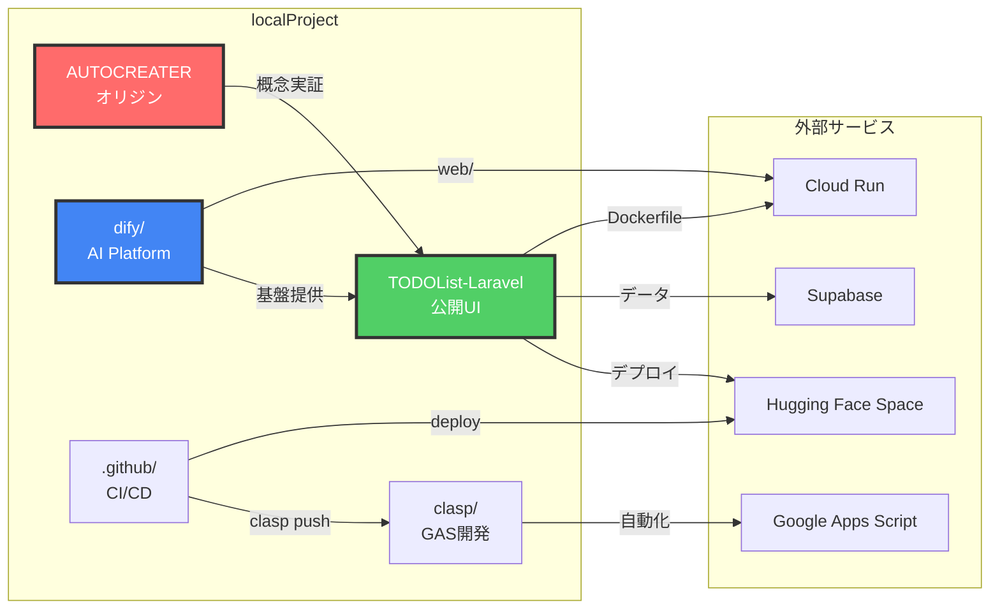
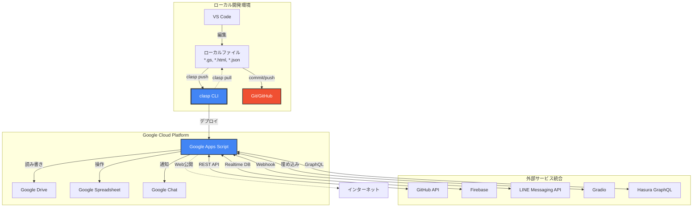
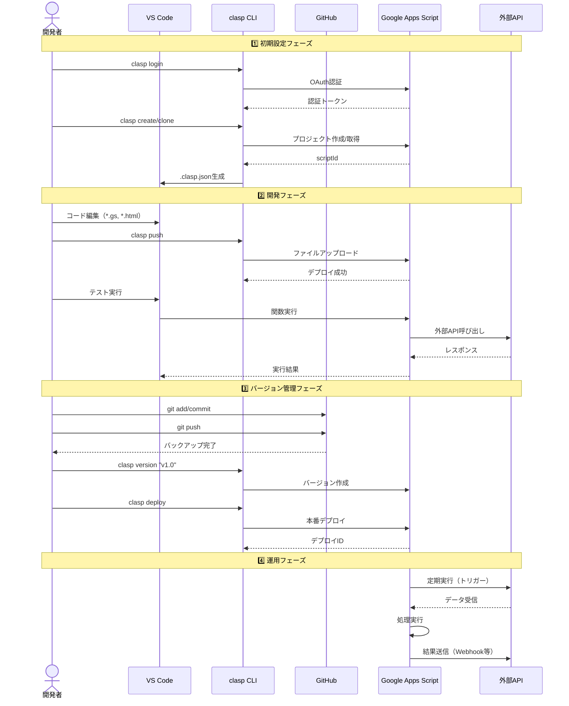
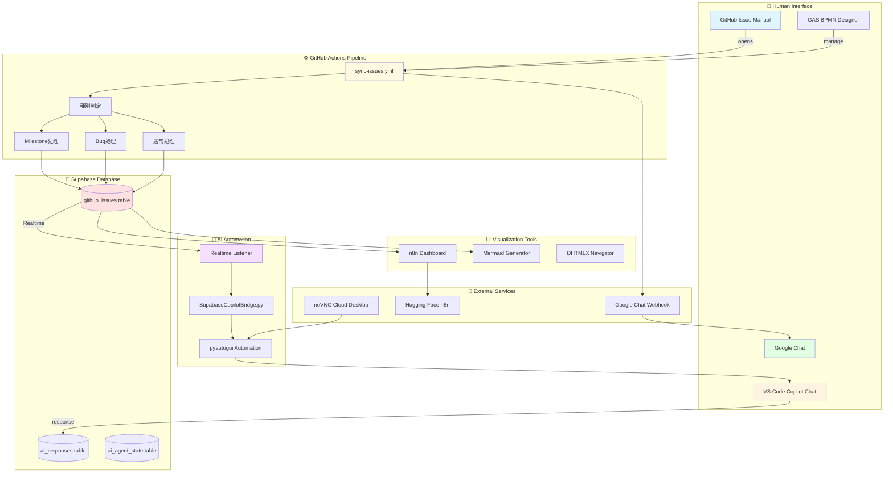
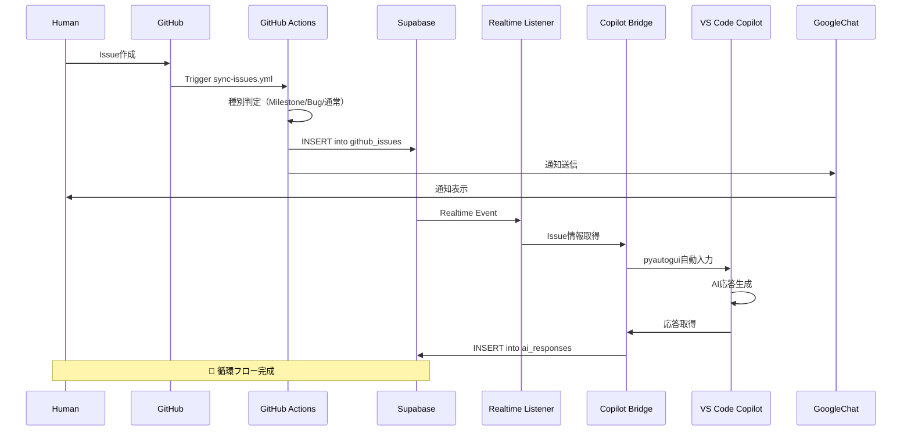

# AI Automation Platform - プロジェクト構成図

**更新日:** 2026-02-28

## 📂 全体ディレクトリツリー

```
C:\xampp\htdocs\
├── 🎯 ai-automation-dashboard/          # GitHub Actions自動化ハブ
│   ├── .github/
│   │   └── workflows/
│   │       ├── sync-issues.yml          # Issue → Supabase + Google Chat ✅
│   │       └── bpmn-flow-demo.yml       # BPMN風フローテスト ✅
│   └── README.md
│
├── 📚 ai-automation-docs/               # ドキュメント + GitHub Pages
│   ├── bpmn/
│   │   ├── memory_workflow.json        # 記憶フロー（9ノード）
│   │   └── task_summary_workflow.json  # タスクまとめBPMN
│   ├── gas/
│   │   ├── Code.gs                     # GAS BPMN Designer
│   │   ├── BpmnDesigner.html           # シンプル版UI
│   │   └── .clasp.json
│   ├── PROJECT_STRUCTURE.md            # このファイル ✅
│   └── README.md
│
├── 🏢 ai-automation-platform/           # bpmbox組織ハブ
│   ├── docs/
│   │   ├── index.md                    # Jekyll landing page
│   │   └── wiki/
│   │       └── System-Architecture.md  # 技術解説
│   ├── supabase/
│   │   └── schema.sql                  # テーブル設計（予定）
│   ├── IMPLEMENTATION_PLAN.md          # 23個のIssue計画
│   └── README.md
│
├── 🔧 localProject/                     # 🎯 メイン開発環境（Difyベース）
│   ├── 🌟 AUTOCREATER/                 # 🏆 オリジナル Hugging Face Space（最初のプロジェクト）
│   │   ├── SupabaseCopilotBridge.py   # Supabase → VS Code Copilot自動入力
│   │   ├── supabase_to_vscode_chat.py # Realtime Listener + pyautogui
│   │   ├── gradio_app.py              # Gradio UI
│   │   ├── requirements.txt
│   │   └── README.md                  # オリジナルプロジェクト説明
│   ├── AUTOCREATE/                     # 本プロジェクト（AUTOCREATER後継）
│   │   ├── SupabaseCopilotBridge.py   # VS Code Copilot自動連携
│   │   └── supabase_to_vscode_chat.py
│   ├── AUTOCREATE.wiki/                # 重要ナレッジベース ⭐（AI記憶回復用）
│   │   ├── Home.md
│   │   ├── Continuity-Guide.md         # AI継続開発ガイド
│   │   ├── System-Architecture.md      # FastAPI Django Main Live
│   │   ├── ai-memory/                  # JSON形式AIメモリ
│   │   ├── knowledge-base/
│   │   └── conversation-logs/
│   ├── 🤖 dify/                        # 🎯 localProject基盤（Dify AI Workflow Platform）
│   │   ├── docker-compose.yml
│   │   ├── .env
│   │   ├── api/
│   │   └── web/
│   ├── 📱 TODOList-Laravel/            # 🎯 公開用プロジェクト（PHPRunner + Laravel統合）
│   │   ├── .github/
│   │   │   └── workflows/
│   │   │       ├── deploy-hf.yml       # Hugging Face自動デプロイ
│   │   │       └── clasp-sync.yml      # clasp同期
│   │   ├── public/
│   │   │   ├── 🔥 n8n/                 # DHTMLX Workflow Builder（超重要UI）
│   │   │   │   ├── index-dhtmlx.html   # DHHTMLXベース可視化
│   │   │   │   ├── builder.html        # ワークフロービルダー
│   │   │   │   ├── dashboard-v3.html   # 最新ダッシュボード
│   │   │   │   ├── api-functions.js    # Supabase API統合
│   │   │   │   ├── supabase-config.js  # Supabase設定
│   │   │   │   └── test-dhtmlx-local.html
│   │   │   ├── phprunner/              # PHPRunnerコア
│   │   │   ├── classes/
│   │   │   └── connections/
│   │   ├── app/                        # Laravelアプリケーション
│   │   ├── routes/
│   │   ├── resources/
│   │   ├── gradio_phprunner_api_generator.py  # GradioベースAPI生成
│   │   ├── composer.json
│   │   └── README.md
│   ├── .github/                        # 🎯 clasp自動デプロイ（localProject全体）
│   │   └── workflows/
│   │       ├── clasp-deploy.yml        # clasp push自動化
│   │       └── gas-sync.yml            # GAS同期
│   ├── fastapi_django_main_live/       # FastAPI + Django統合
│   ├── n8n-free/                       # n8n無料版設定
│   ├── supabase/                       # Supabaseローカル設定
│   │   ├── config.toml
│   │   └── seed.sql
│   └── clasp/                          # 🔑 GAS開発ツール集（超重要）
│       ├── workflow/                   # clasp管理GASプロジェクト
│       │   ├── .clasp.json             # GASプロジェクト設定
│       │   ├── appsscript.json         # GASマニフェスト
│       │   ├── github.js               # GitHub API統合
│       │   ├── google_chat.js          # Google Chat連携
│       │   ├── firebase.js             # Firebase統合
│       │   ├── line.html               # LINE Bot UI
│       │   └── gradio.html             # Gradio統合UI
│       ├── gas-frontend/               # GASフロントエンド開発
│       ├── spreadsheet-project/        # Spreadsheet連携プロジェクト
│       ├── chrome-ocr-sidebar/         # Chrome拡張（OCR）
│       ├── phprunner-api-generator-gas/# PHPRunner API生成
│       ├── cloudrun-n8n/               # Cloud Run n8n設定
│       ├── README.md                   # clasp全体ドキュメント
│       ├── SYSTEM_ARCHITECTURE.md      # claspシステム設計
│       └── UNIVERSAL_API_GUIDE.md      # 汎用API使用ガイド
│
├── 📊 n8n_workflows/                    # n8n可視化・管理
│   ├── n8n_mermaid_dash.html
│   ├── n8n_local_visualizer.html
│   ├── gen_mermaid_local.py
│   ├── n8n_download.py
│   └── n8n_check.py
│
├── 🐍 Python スクリプト群/
│   ├── supabase_crud.html              # SupabaseブラウザCRUD
│   ├── create_n8n_issue.py             # n8n→Issue作成
│   ├── fix_issue27.py
│   ├── inspect_mermaid_wf.py
│   └── extract_mermaid_html.py
│
├── 🔨 PhPRunner_11/                     # Laravel/PHP プロジェクト
│   ├── .github/
│   │   └── workflows/
│   │       ├── notify-issue-to-googlechat.yml
│   │       ├── auto-assign-copilot.yml  # Copilot自動アサイン
│   │       ├── cloud-agent.yml          # /executeコマンド
│   │       └── deploy-n8n-workflows.yml
│   └── ...
│
├── 🎨 evaProject/                       # Laravel プロジェクト
│   ├── artisan
│   ├── composer.json
│   ├── googleChat.php                  # Google Chat連携
│   └── app/
│
├── 📦 strapi-cms-hf/                    # Headless CMS
│
├── 🌐 DHTMLX Navigator/
│   ├── dhtmlx_navigator.html
│   └── navigator.html
│
├── 🔄 整理対象（削除候補）/
│   ├── shop11/                         # 本体
│   ├── shop11 copy/
│   ├── shop11_backup/
│   ├── shop11_build/
│   ├── shop11.worktrees/
│   ├── shop11bk/
│   ├── phprunner-laravel-blade/
│   ├── phprunner-react-frontend/
│   └── phprunner11/
│
└── .venv/                              # Python仮想環境
```

---

## 🔧 localProject - メイン開発環境

**パス:** `C:\xampp\htdocs\localProject\`  
**基盤:** Dify AI Workflow Platform  
**目的:** 統合開発環境・自動化プラットフォーム

### 🏆 プロジェクト構成（重要度順）

#### 1. 🌟 AUTOCREATER/ - オリジナルプロジェクト
**パス:** `localProject/AUTOCREATER/`  
**目的:** 最初のPython Hugging Face Space（全ての起点）  
**Hugging Face:** kenken999/AUTOCREATER

**主要ファイル:**
- `SupabaseCopilotBridge.py` - Supabase Realtime → VS Code Copilot自動入力
- `supabase_to_vscode_chat.py` - pyautogui + Realtime Listener実装
- `gradio_app.py` - Gradio UI（初期バージョン）
- `requirements.txt` - Python依存関係

**歴史的重要性:**
- Supabase → VS Code Copilot連携の概念実証
- pyautogui自動化の原型
- GitHub Issue → AI応答 自動化の起点

---

#### 2. 🤖 dify/ - localProject基盤
**パス:** `localProject/dify/`  
**目的:** Dify AI Workflow Platform（localProject全体の基盤）  
**公式:** https://dify.ai/

**構成:**
```
dify/
├── docker-compose.yml       # Dify全体のDocker構成
├── .env                     # Dify環境変数
├── api/                     # Dify Backend (FastAPI)
├── web/                     # 🔥 Dify Frontend (Next.js) ← これが「cloudrun-web」候補
│   ├── next.config.js
│   ├── package.json
│   └── app/
└── worker/                  # Difyワーカー
```

**web/ (Dify Frontend) 詳細:**
- **技術スタック:** Next.js 14 + TypeScript + Tailwind CSS
- **パス:** `localProject/web/`
- **起動:** `pnpm install` → `pnpm dev`
- **URL:** http://localhost:3000
- **Docker:** `Dockerfile` でCloud Runデプロイ可能
- **重要性:** Dify UIの本体、カスタマイズ可能

**用途:**
- AI Workflowビジュアル構築
- LLMチェーン管理
- RAG（Retrieval-Augmented Generation）
- エージェント構築

---

#### 3. 📱 TODOList-Laravel/ - 公開用プロジェクト
**パス:** `localProject/TODOList-Laravel/`  
**目的:** PHPRunner + Laravel統合プロジェクト（公開用）  
**Hugging Face:** kenken999/TODOList-Laravel

**主要構成:**
```
TODOList-Laravel/
├── .github/
│   └── workflows/
│       ├── deploy-hf.yml              # Hugging Face自動デプロイ
│       └── clasp-sync.yml             # clasp同期
├── public/
│   ├── 🔥 n8n/                        # ← 超重要！DHTMLX Workflow Builder
│   │   ├── index-dhtmlx.html          # DHHTMLXベースUI
│   │   ├── builder.html               # ワークフロービルダー
│   │   ├── dashboard-v3.html          # 最新ダッシュボード（推奨）
│   │   ├── api-functions.js           # Supabase CRUD API
│   │   ├── supabase-config.js         # Supabase接続設定
│   │   └── test-dhtmlx-local.html     # ローカルテスト
│   ├── phprunner/                     # PHPRunnerコア
│   ├── classes/
│   └── connections/
├── app/                               # Laravelアプリ
├── routes/
├── resources/
├── gradio_phprunner_api_generator.py  # GradioベースAPI生成ツール
├── composer.json
└── README.md
```

**public/n8n/ - DHTMLX Workflow Builder:**
- **目的:** n8nワークフローのDHTMLX可視化・編集
- **技術:** DHTMLX Diagram + Supabase REST API
- **機能:**
  - ワークフロー一覧表示
  - ノード追加・編集・削除
  - ビジュアルエディタ
  - Supabase `workflow_entity` テーブル連携
- **推奨URL:** `public/n8n/dashboard-v3.html`

**Gradio API生成ツール:**
- `gradio_phprunner_api_generator.py` - PHPRunner → REST API自動生成
- Hugging Face Spaceで公開

---

#### 4. 🔑 clasp/ - GAS開発ツール集
**パス:** `localProject/clasp/`  
**目的:** Google Apps Script統合開発環境

（詳細は「clasp詳細セクション」参照）

---

#### 5. .github/ - clasp自動デプロイ
**パス:** `localProject/.github/workflows/`  
**目的:** localProject全体のGitHub Actions設定

**主要ワークフロー:**
- `clasp-deploy.yml` - clasp push自動化（clasp/配下のGASプロジェクト）
- `gas-sync.yml` - GAS同期確認

**トリガー:**
- `push` to `main` branch `clasp/**`
- Manual dispatch

---

#### 6. その他重要ディレクトリ

| ディレクトリ | 用途 | 重要度 |
|------------|------|-------|
| `fastapi_django_main_live/` | FastAPI + Django統合アーキテクチャ | 🔴 高 |
| `AUTOCREATE.wiki/` | AI継続開発ナレッジベース | 🔴 最高 |
| `n8n-free/` | n8n無料版設定 | 🟡 中 |
| `supabase/` | Supabaseローカル設定（seed.sql, config.toml） | 🟡 中 |
| `workflow/` | ワークフロー管理 | 🟡 中 |
| `api-workflow-builder/` | API統合ワークフロービルダー | 🟢 低 |
| `webtop-dev/` | Cloud Run Webtop開発環境 | 🟢 低 |

---

### 🔗 localProject連携フロー



---

### 💡 cloudrun-web について

**お探しの「cloudrun-web」は以下の可能性があります:**

1. **localProject/web/** (最有力)
   - Dify Frontend (Next.js)
   - Dockerfileあり (`localProject/web/Dockerfile`)
   - Cloud Runデプロイ可能

2. **localProject/clasp/cloudrun-n8n/**
   - n8nのCloud Runデプロイ設定
   - `deploy-cloudrun.sh` スクリプト

3. **localProject/webtop-dev/**
   - Cloud Run Webtop環境
   - VSCode, Navicat, PHPRunner含む

**確認方法:**
```powershell
# web/のDockerfile確認
cat C:\xampp\htdocs\localProject\web\Dockerfile

# cloudrun関連検索
cd C:\xampp\htdocs\localProject
Select-String -Path . -Pattern "cloudrun" -Recurse
```

---

## 🎯 核心プロジェクト

### ai-automation-dashboard
**目的:** GitHub Actions自動化ハブ  
**パス:** `C:\xampp\htdocs\ai-automation-dashboard\`  
**リポジトリ:** kenichimiyata/ai-automation-dashboard

**主要ファイル:**
- `.github/workflows/sync-issues.yml` - Issue → Supabase + Google Chat
- `.github/workflows/bpmn-flow-demo.yml` - BPMN風フローテスト

**GitHub Secrets:**
- `SUPABASE_URL`: https://rootomzbucovwdqsscqd.supabase.co
- `SUPABASE_ANON_KEY`: (登録済み)
- `GH_TOKEN`: ghp_**********************（マスク）
- `GOOGLE_CHAT_WEBHOOK`: (登録済み)

---

### ai-automation-docs
**目的:** ドキュメント管理 + GitHub Pages  
**パス:** `C:\xampp\htdocs\ai-automation-docs\`  
**リポジトリ:** kenichimiyata/ai-automation-docs  
**公開URL:** https://kenichimiyata.github.io/ai-automation-docs/

**主要ファイル:**
- `bpmn/memory_workflow.json` - 記憶フロー（9ノード）
- `bpmn/task_summary_workflow.json` - タスクまとめBPMN
- `gas/Code.gs` - GAS BPMN Designer
- `gas/BpmnDesigner.html` - シンプル版UI
- **NEW:** `PROJECT_STRUCTURE.md` (このファイル)

**GAS公開URL:**
https://script.google.com/macros/s/AKfycbzOFStOJRdYblPXloslKV0rDmzP24aO9uQuudQn_koE_ENnqdFfLX98svbyJOJ2Vx1_/exec

---

### ai-automation-platform
**目的:** bpmbox組織ハブ + wiki  
**パス:** `C:\xampp\htdocs\ai-automation-platform\`  
**リポジトリ:** bpmbox/ai-automation-platform  
**GitHub Pages:** https://bpmbox.github.io/ai-automation-platform/

**主要ファイル:**
- `IMPLEMENTATION_PLAN.md` - 23個のIssue実装計画
- `docs/index.md` - Jekyll landing page
- `docs/wiki/System-Architecture.md` - 技術解説
- `supabase/schema.sql` - テーブル設計（予定）

---

## 🔧 開発環境・ツール

### DHTMLX Navigator
**パス:** `C:\xampp\htdocs\`
- `dhtmlx_navigator.html` - DHX Navigator UI
- `navigator.html` - カスタムナビゲーター

**用途:** ファイルツリー可視化、ワークスペース整理

---

### n8n Workflows
**パス:** `C:\xampp\htdocs\n8n_workflows\`
- `n8n_mermaid_dash.html` - n8nダッシュボード
- `n8n_local_visualizer.html` - ローカル可視化ツール
- `gen_mermaid_local.py` - Mermaid生成スクリプト

**Hugging Face n8n:**
- URL: https://kenken999-n8n-free.hf.space/
- Workflow ID: OSJHT5V0y7LN9NNJ

---

### Supabase
**エンドポイント:** https://rootomzbucovwdqsscqd.supabase.co  
**Anon Key:** eyJhbGc...（GitHub Secretに登録済み）

**テーブル（予定）:**
- `github_issues` - Issue同期テーブル
- `ai_responses` - AI応答ログ
- `ai_agent_state` - エージェント状態

**RLS & Realtime:** 有効化予定（Milestone 1）

---

## � clasp - Google Apps Script開発環境（超重要）
### 🔗 clasp全体アーキテクチャ図



### 🔄 clasp開発フロー（シーケンス図）



### 🌐 clasp統合サービス一覧

| カテゴリ | サービス/ツール | 用途 | 統合方法 |
|---------|---------------|------|---------|
| **開発環境** | VS Code | コード編集・デバッグ | clasp CLI |
|  | TypeScript | 型安全開発 | @types/google-apps-script |
|  | Git/GitHub | バージョン管理 | clasp push → git commit |
|  | ESLint/Prettier | コード品質管理 | .eslintrc, .prettierrc |
| **Google サービス** | Google Apps Script | 実行環境 | clasp push/pull/deploy |
|  | Google Spreadsheet | データ管理 | SpreadsheetApp API |
|  | Google Drive | ファイル保存 | DriveApp API |
|  | Google Chat | 通知・Bot | Webhook + Card V2 |
|  | Gmail | メール送信 | GmailApp API |
|  | Calendar | スケジュール | CalendarApp API |
| **外部API統合** | GitHub API | Issue/PR管理 | UrlFetchApp + REST API |
|  | Firebase | Realtime Database | REST API |
|  | Supabase | PostgreSQL DB | REST API + API Key |
|  | LINE Messaging | LINE Bot | Webhook + Reply API |
|  | Gradio | AI UI統合 | iframe埋め込み |
|  | Hasura | GraphQL | UrlFetchApp + GraphQL |
|  | n8n | ワークフロー | Webhook連携 |
| **認証・セキュリティ** | OAuth 2.0 | Google認証 | ScriptApp.getOAuthToken() |
|  | Service Account | サーバー認証 | JWT + Private Key |
|  | API Key | 外部API認証 | PropertiesService |
|  | Secret Manager | 機密情報管理 | Google Cloud Secret Manager |
| **デプロイ・自動化** | GitHub Actions | CI/CD | clasp push自動化 |
|  | Cloud Scheduler | 定期実行 | GASトリガー呼び出し |
|  | Webhook | イベント駆動 | doPost(e), doGet(e) |
|  | Cloud Functions | サーバーレス | REST API連携 |
### clasp とは？
**Command Line Apps Script Projects** - Google Apps Scriptをローカルで開発・管理するための公式CLIツール

**パス:** `C:\xampp\htdocs\localProject\clasp\`

### 🎯 主な用途
1. **GASコードのバージョン管理** - ローカルGit管理、GitHub連携
2. **複数人開発** - コードレビュー、マージ、ブランチ管理
3. **自動デプロイ** - CI/CD、GitHub Actionsとの統合
4. **TypeScript開発** - 型安全なGAS開発
5. **プロジェクト管理** - 複数GASプロジェクトの一元管理

### 📂 clasp主要プロジェクト

#### 1. workflow/ - 統合ワークフロープロジェクト
**Script ID:** `196fU31y5azfVbp7F2I4wHW_31zZj343fMe-HjdhEDPgcLu1VCMQJyVqq`

**主要ファイル:**
- `.clasp.json` - GASプロジェクト設定（scriptId, rootDir）
- `appsscript.json` - GASマニフェスト（timeZone, dependencies, oauthScopes）
- `github.js` - GitHub API統合（Issue作成、PR管理）
- `google_chat.js` - Google Chat通知・Bot連携
- `firebase.js` - Firebase Realtime Database/Firestore
- `line.html` - LINE Bot UI・Webhook処理
- `gradio.html` - Gradio UI統合
- `spreadsheet.js` - Google Spreadsheet操作

**統合サービス:**
- GitHub API
- Google Chat Webhook
- Firebase
- LINE Messaging API
- Gradio
- Hasura GraphQL

#### 2. gas-frontend/ - GASフロントエンド開発
Webアプリ用HTML/CSS/JavaScript開発環境

#### 3. spreadsheet-project/ - Spreadsheet連携
Google Spreadsheet専用マクロ・カスタム関数

#### 4. chrome-ocr-sidebar/ - Chrome拡張機能
OCR機能付きサイドバー拡張（GAS連携）

#### 5. phprunner-api-generator-gas/ - PHPRunner API生成
PHPRunnerプロジェクトからGAS API自動生成ツール

#### 6. cloudrun-n8n/ - Cloud Run n8n設定
n8nのCloud Runデプロイ設定ファイル

### 🛠️ clasp コマンド一覧

| コマンド | 用途 | 例 |
|---------|------|-----|
| `clasp login` | Google認証 | `clasp login` |
| `clasp create` | 新規GASプロジェクト作成 | `clasp create --type standalone --title "MyProject"` |
| `clasp clone` | 既存プロジェクトをローカルにクローン | `clasp clone <scriptId>` |
| `clasp push` | ローカル変更をGASにアップロード | `clasp push` |
| `clasp pull` | GASの最新版をローカルにダウンロード | `clasp pull` |
| `clasp open` | ブラウザでGASエディタを開く | `clasp open` |
| `clasp deploy` | 新しいバージョンをデプロイ | `clasp deploy -d "v1.0"` |
| `clasp version` | バージョン番号作成 | `clasp version "新機能追加"` |
| `clasp versions` | バージョン一覧表示 | `clasp versions` |
| `clasp deployments` | デプロイメント一覧 | `clasp deployments` |

### 📝 重要ファイル解説

#### .clasp.json
```json
{
  "scriptId": "196fU31y5azfVbp7F2I4wHW_31zZj343fMe-HjdhEDPgcLu1VCMQJyVqq",
  "rootDir": "./",
  "fileExtension": "js"
}
```
- `scriptId`: GASプロジェクトの一意識別子
- `rootDir`: プッシュ対象ディレクトリ
- `fileExtension`: ファイル拡張子（js/ts）

#### appsscript.json
```json
{
  "timeZone": "Asia/Tokyo",
  "dependencies": {
    "enabledAdvancedServices": []
  },
  "exceptionLogging": "STACKDRIVER",
  "runtimeVersion": "V8",
  "oauthScopes": [
    "https://www.googleapis.com/auth/spreadsheets",
    "https://www.googleapis.com/auth/script.external_request"
  ]
}
```
- `timeZone`: タイムゾーン設定
- `dependencies`: 高度なサービス有効化
- `runtimeVersion`: V8エンジン（最新）
- `oauthScopes`: 必要な権限スコープ

### 🔗 関連ドキュメント

| ドキュメント | パス | 内容 |
|------------|------|------|
| README.md | `localProject/clasp/README.md` | clasp全体ドキュメント |
| SYSTEM_ARCHITECTURE.md | `localProject/clasp/SYSTEM_ARCHITECTURE.md` | システム設計書 |
| UNIVERSAL_API_GUIDE.md | `localProject/clasp/UNIVERSAL_API_GUIDE.md` | 汎用API使用ガイド |
| GITHUB_ACTIONS_SETUP.md | `localProject/clasp/GITHUB_ACTIONS_SETUP.md` | GitHub Actions連携 |
| HUGGING_FACE_DEPLOYMENT.md | `localProject/clasp/HUGGING_FACE_DEPLOYMENT.md` | Hugging Faceデプロイ |

### 🎓 clasp使用例

#### 新規プロジェクト作成からデプロイまで
```powershell
# 1. 新規プロジェクト作成
clasp create --type standalone --title "My Automation"

# 2. コード編集（VS Codeなどで）
# code.js, index.html などを作成

# 3. GASにプッシュ
clasp push

# 4. ブラウザで確認
clasp open

# 5. デプロイ
clasp deploy -d "初回リリース"
```

#### 既存プロジェクトのクローン・編集
```powershell
# 1. プロジェクトクローン
cd C:\xampp\htdocs\localProject\clasp
clasp clone <scriptId>

# 2. コード編集

# 3. プッシュ
clasp push

# 4. 最新版取得（他の人が編集した場合）
clasp pull
```

### 🔐 認証情報
clasp認証情報は `~/.clasprc.json` に保存（OAuth2トークン）

**⚠️ セキュリティ:**
- `.clasprc.json` は絶対にGitにコミットしない
- scriptIdは公開しても安全（実行権限は別）
- GitHub Actionsではサービスアカウント使用推奨

### 🚀 今後の活用予定
- [ ] GitHub Actions → clasp push 自動化
- [ ] Issue作成時にGAS関数自動実行
- [ ] Supabase → GAS → Spreadsheet 自動同期
- [ ] clasp + TypeScript 型安全開発

---

## �🐍 Python スクリプト群

### Supabase連携
**パス:** `C:\xampp\htdocs\localProject\AUTOCREATER\`
- `SupabaseCopilotBridge.py` - VS Code Copilot Chat自動連携
- `supabase_to_vscode_chat.py` - Realtime Listener

**パス:** `C:\xampp\htdocs\`
- `supabase_crud.html` - SupabaseブラウザCRUD
- `phprunner_json_history_supabase.sql` - 履歴テーブル

### n8n関連
- `n8n_download.py` - n8nワークフローダウンロード
- `n8n_download_remaining.py` - 残りダウンロード
- `n8n_check.py` - API接続確認

### GitHub関連
- `create_n8n_issue.py` - n8nからIssue作成
- `fix_issue27.py` - Issue #27修正スクリプト

### Mermaid可視化
- `gen_mermaid_local.py` - ローカル生成
- `inspect_mermaid_wf.py` - ワークフロー解析
- `extract_mermaid_html.py` - HTML抽出

---

## 🔨 Laravel / PHP プロジェクト

### PhPRunner_11
**パス:** `C:\xampp\htdocs\PhPRunner_11\`  
**リポジトリ:** (未確認)

**GitHub Actions:**
- `notify-issue-to-googlechat.yml` - Issue通知
- `auto-assign-copilot.yml` - Copilot自動アサイン
- `cloud-agent.yml` - `/execute`コマンド実行
- `deploy-n8n-workflows.yml` - n8nデプロイ

### evaProject
**パス:** `C:\xampp\htdocs\evaProject\`  
**フレームワーク:** Laravel

**主要ファイル:**
- `composer.json` - PHP依存関係
- `artisan` - Laravelコマンドライン
- `googleChat.php` - Google Chat連携

---

## 🎨 Strapi CMS

### strapi-cms-hf
**パス:** `C:\xampp\htdocs\strapi-cms-hf\`  
**用途:** Headless CMS（Hugging Face連携？）

---

## 🖥️ noVNC / Cloud Desktop

### Selkies WebTop
**URL:** https://webtop-desktop-27951941726.asia-northeast1.run.app/  
**認証:** abc:changeme123

**用途:**
- Cloud Desktopアクセス
- リモートブラウザ操作
- Playwright実行環境

---

## 📦 重複・整理対象フォルダー

### shop11系（削除候補）
- `shop11/` - 本体
- `shop11 copy/`
- `shop11_backup/`
- `shop11_build/`
- `shop11.worktrees/`
- `shop11bk/`

### phprunner系（削除候補）
- `phprunner-laravel-blade/`
- `phprunner-react-frontend/`
- `phprunner11/`

### その他重複
- `shop5/` `shop5_compare/` `shop6/`
- `ai-automation-platform-repo/` (ドキュメント重複)
- `ai-automation-platform.wiki/` `ai-automation-platform-wiki/` (wiki重複)

**整理方針:** 最新版のみ残し、GitHubバックアップ後に削除

---

## 🔗 関連Wiki・ドキュメント

### localProject/AUTOCREATE.wiki
**パス:** `C:\xampp\htdocs\localProject\AUTOCREATE.wiki\`  
**リポジトリ:** bpmbox/AUTOCREATE の wiki

**重要ファイル:**
- `Home.md` - インデックス
- `Continuity-Guide.md` - AI継続開発ガイド
- `System-Architecture.md` - FastAPI Django アーキテクチャ
- `AI-Developer-Collaboration-Guide.md` - AI協働哲学
- `Memory-Restore-System-Guide.md` - AI記憶回復
- `GitHub-Issue-System-Generator-Guide.md` - Issue自動生成

**サブフォルダー:**
- `ai-memory/` - JSON形式AIメモリ
- `knowledge-base/` - ナレッジベース
- `conversation-logs/` - 会話ログ
- `implementation-examples/` - 実装例

---

## 🚀 今後の追加予定

### Milestone 1: Supabase Infrastructure
- テーブル作成（github_issues, ai_responses, ai_agent_state）
- RLS ポリシー設定
- Realtime有効化

### Milestone 2: GitHub Actions完成
- sync-issues.yml完全版（現在ベータ版動作中）
- エラーハンドリング強化
- 詳細ロギング

### Milestone 3: VS Code Copilot Bridge
- Supabase Realtime Listener
- pyautogui自動入力
- 応答ストレージ

---

## � 全体アーキテクチャ図（Mermaid）



### システム連携フロー



---

## 🌐 サービス一覧・URL・認証情報

### GitHub Repositories

| リポジトリ | Owner | URL | アクセス | 用途 |
|-----------|-------|-----|---------|------|
| ai-automation-dashboard | kenichimiyata | https://github.com/kenichimiyata/ai-automation-dashboard | Public | GitHub Actions実行ハブ |
| ai-automation-docs | kenichimiyata | https://github.com/kenichimiyata/ai-automation-docs | Public | ドキュメント + Pages |
| ai-automation-platform | bpmbox | https://github.com/bpmbox/ai-automation-platform | Public | 組織ハブ + wiki |

### GitHub Pages

| サイト | URL | ステータス |
|--------|-----|-----------|
| kenichimiyata docs | https://kenichimiyata.github.io/ai-automation-docs/ | ✅ 公開中 |
| bpmbox platform | https://bpmbox.github.io/ai-automation-platform/ | 🔧 設定中 |

### GitHub Projects

| プロジェクト | URL | オーナー |
|------------|-----|---------|
| Project #6 (Public) | https://github.com/users/kenichimiyata/projects/6 | kenichimiyata |
| Project #8 | https://github.com/orgs/bpmbox/projects/8 | bpmbox |

### Supabase

| 項目 | 値 | 備考 |
|------|-----|------|
| エンドポイント | `https://rootomzbucovwdqsscqd.supabase.co` | REST API |
| Anon Key | `eyJhbGc...` | GitHub Secretに保存 |
| Realtime | ✅ 有効 | Webhook対応 |
| RLS (Row Level Security) | 🔧 設定予定 | Milestone 1 |

**テーブル一覧:**
- `github_issues` - Issue同期データ
- `ai_responses` - Copilot応答ログ
- `ai_agent_state` - エージェント状態管理

### Google Apps Script

| サービス | URL | 認証 |
|----------|-----|------|
| BPMN Designer (本番) | https://script.google.com/macros/s/AKfycbzOFStOJRdYblPXloslKV0rDmzP24aO9uQuudQn_koE_ENnqdFfLX98svbyJOJ2Vx1_/exec | ANYONE_ANONYMOUS |
| BPMN Designer (dev) | https://script.google.com/a/macros/urlounge.co.jp/s/AKfycbw3WJEVFoIkc8JHnXtWrm9Cs2Om_6ODqp0s_NTvvDIg/dev | 要認証 |
| Script Editor | https://script.google.com/u/1/home/projects/10zRCJZXrcPhhDQ2NhJBtVTGSuDvmH-MWyA9VAuJmOHyVpDDCPRa3vAF4/edit | 要認証 |

### Google Chat

| 項目 | 値 |
|------|-----|
| Webhook URL | `https://chat.googleapis.com/v1/spaces/AAAAi6uA0xw/messages?key=...` |
| 保存場所 | GitHub Secret: `GOOGLE_CHAT_WEBHOOK` |
| 通知タイミング | Issue作成・編集・クローズ |

### Hugging Face Spaces

| サービス | URL | 認証 | 用途 |
|----------|-----|------|------|
| n8n Free Instance | https://kenken999-n8n-free.hf.space/ | 要ログイン | ワークフロー自動化 |
| My workflow 6 | https://kenken999-n8n-free.hf.space/workflow/OSJHT5V0y7LN9NNJ | 要ログイン | 主要ワークフロー |

### Cloud Desktop (noVNC/Selkies)

| 項目 | 値 |
|------|-----|
| URL | https://webtop-desktop-27951941726.asia-northeast1.run.app/ |
| ユーザー名 | `abc` |
| パスワード | `changeme123` |
| 用途 | リモートブラウザ操作、Playwright実行環境 |

### Google AI Studio

| サービス | URL | 用途 |
|----------|-----|------|
| リファスタ AI査定員 | https://aistudio.google.com/apps/1e5fe3dc-642c-42f8-8cb0-6381d847c5df | AI実験プラットフォーム |

### Google Spreadsheet

| ドキュメント | URL | 用途 |
|------------|-----|------|
| t-lounge | https://docs.google.com/spreadsheets/d/1cJkeKCEeuOfM0WAc9Vly8Gj-Ai6uU4674uLuE2MlYp4/edit | データ管理 |

### ローカルサービス

| サービス | URL | ポート |
|----------|-----|--------|
| Apache (XAMPP) | http://localhost/ | 80 |
| MySQL (XAMPP) | localhost | 3306 |
| Gradio (SupabaseCopilotBridge) | http://127.0.0.1:7872 | 7872 |

---

## �📊 全体フロー図

```
┌─────────────────┐
│ GitHub Issue    │
│  (Manual)       │
└────────┬────────┘
         │
         ▼
┌─────────────────────────────┐
│ GitHub Actions              │
│ (sync-issues.yml)           │
│  ├─ 種別判定                │
│  ├─ 分岐処理                │
│  ├─ Supabase同期 ←──────────┼─ Milestone 1
│  └─ Google Chat通知 ✅      │
└────────┬────────────────────┘
         │
         ▼
┌─────────────────────────────┐
│ Supabase Realtime           │
│  github_issues テーブル     │
└────────┬────────────────────┘
         │
         ▼
┌─────────────────────────────┐
│ ローカル常駐スクリプト       │
│ (SupabaseCopilotBridge.py)  │← Milestone 3
│  ├─ Realtime Listener       │
│  ├─ pyautogui操作           │
│  └─ 応答保存                │
└────────┬────────────────────┘
         │
         ▼
┌─────────────────────────────┐
│ VS Code Copilot Chat        │
│  (自動入力・応答取得)        │
└─────────────────────────────┘
```

---

## 🔐 認証情報・トークン管理

**GitHub Tokens:**
- kenichimiyata: `ghp_**********************`（マスク - GitHub Secretで管理）
- bpmbox: `ghp_**********************`（マスク - GitHub Secretで管理）

**Supabase:**
- URL: `https://rootomzbucovwdqsscqd.supabase.co`
- Anon Key: `eyJhbGc...` (GitHub Secretに保存)

**Google Chat Webhook:**
- `https://chat.googleapis.com/v1/spaces/AAAAi6uA0xw/messages?key=...` (GitHub Secretに保存)

**⚠️ セキュリティ:** トークンは `.env` と GitHub Secrets で管理、コードに直接書かない

---

## 📅 最終更新履歴

| 日付 | 内容 |
|------|------|
| 2026-02-28 | PROJECT_STRUCTURE.md作成 |
| 2026-02-28 | sync-issues.yml Google Chat統合 |
| 2026-02-28 | bpmn-flow-demo.yml作成・実行成功 |
| 2026-02-27 | GitHub Secrets登録（3つ） |
| 2026-02-27 | GAS BPMN Designer公開 |
| 2026-02-27 | Issue #32作成・Project #6追加 |
