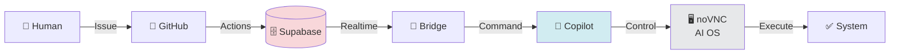

# AI Automation Platform

> **10年越しの挑戦が、今、実現する。**  
> Maintained by [@kenichimiyata](https://github.com/kenichimiyata) | [GitHub Pages](https://kenichimiyata.github.io/ai-automation-docs/)

---

## The Story

### 2013 — The Dream Begins

私は [bpmchat.com](https://www.bpmchat.com/) というサイトで夢を描いた。

**「チャット × ワークフロー × AI で、業務システムを自然に作れる世界」**

- チャットで指示すれば、BPMNワークフローが動く
- 音声入力で、データが自動登録される
- 画面は Drag & Drop で作り、その場で動作確認できる

これが実現すれば、開発者とユーザーの境界が消える。  
**誰もが、自分の業務を自動化できる。**

---

### 2013-2025 — The Struggle

しかし、**BPMN は難しかった。**

- **ProcessMaker** — 画面作成は良いが、柔軟性がない
- **n8n** — ノードは直感的だが、複雑なフローで破綻する
- **dify** — チャットは簡単だが、データ連携が弱い
- **UiPath** — RPA は強力だが、保守が地獄

Lambda、GAS、AppSheet、SpreadSheet、JIRA... あらゆるツールを組み合わせた。  
それでも、**「作って動かしながら考える」は実現できなかった。**

ツールは増え、メンテナンスは複雑になり、  
**私は10年以上、この壁に挑戦し続けた。**

---

### 2026 — The Breakthrough

**VS Code Copilot と出会った。**

対話しながらコードを書く。  
Issue を書けば、AI が実装する。  
GitHub Actions で自動化し、Supabase で状態を管理する。

これは、bpmchat.com の夢の進化形だ。

- ✅ **チャット × ワークフロー** → Issue × GitHub Actions
- ✅ **音声入力** → VS Code Copilot Chat
- ✅ **Drag & Drop** → Supabase Studio + n8n
- ✅ **その場で動作確認** → Realtime + Local Visualizers

**AI と一緒に作る。これが答えだった。**

10年の経験と、AI の力が融合した。  
今度こそ、実現できる。

---

## What is AI Automation Platform?

**GitHub Issue 駆動型の AI 協働開発基盤 + AI 専用 OS**

```
人間（Issue 作成）
     ↓
GitHub Actions（自動化パイプライン）
     ↓
Supabase（Realtime 状態管理）
     ↓
VS Code Copilot（AI 実装）
     ↓
noVNC Gateway（AI 用仮想デスクトップ）
     ↓
完成したシステム
```

従来の BPMS とは違い、**開発者のツール（GitHub, VS Code）の中で完結する。**  
そして、**AI が noVNC を通じて「自分のPC」を持つ。**

AI が常に隣にいて、一緒に作る。  
いや、AI は「リモートワーカー」として、人間と同じ環境で働く。

これが、10年越しの答えだ。

---

## The Philosophy

### AI が AI に指示して連携していく

```
「AIがAIに指示して　連携していく
それが　シンクライアントであれば
目、口、耳をもったようなものだよ　こぴがｗ」
```

**これが意味すること:**

- **AI 同士の連携** → 単独の AI ではなく、AI エコシステム
- **シンクライアント（noVNC Gateway）= AI の感覚器官:**
  - 👁️ **目:** 画面をキャプチャして「見る」
  - 🗣️ **口:** コマンドを実行して「話す」
  - 👂 **耳:** 出力を受け取って「聞く」

**革命的な点:**
- AI は「脳」だけでは動けない
- **noVNC Gateway という「身体」を得て、初めて行動できる**
- 複数の AI が同じ「身体」を共有 → AI エコシステムの実現
- **シンクライアント = AI と物理世界のインターフェース**

**Copilot（こぴ）が "目・口・耳" を持つ:**
- 単なる「チャットボット」ではない
- **「存在」として、環境と対話できる**
- **AI が AI に指示 → 自律的な協働システム**

これは、bpmchat.com の VirtualOffice（人間用）が、noVNC Gateway（AI用）に進化した意味でもある。

---

## Architecture

### Core Components

| Component | Technology | Purpose |
|-----------|-----------|---------|
| **Data Layer** | Supabase (PostgreSQL + Realtime) | Issue 同期・状態管理・RLS |
| **Pipeline** | GitHub Actions | Issue 作成 → Supabase 自動書き込み |
| **Integration** | VS Code Copilot Bridge (Python) | Supabase Realtime → Copilot Chat |
| **AI OS** | noVNC Gateway | AI 専用仮想デスクトップ・pyautogui 自動操作 |
| **Workflow** | n8n (59 workflows) | 外部サービス連携 |
| **Visualization** | HTML5 (dhtmlx, Mermaid) | BPMN × データ可視化 |

### Evolution from bpmchat.com

| bpmchat.com (2013-2025) | AI Automation Platform (2026-) |
|-------------------------|--------------------------------|
| GAS + ProcessMaker + Lambda | Supabase + GitHub Actions + VS Code Copilot |
| チャット駆動 | Issue 駆動 |
| SpreadSheet 中心 | PostgreSQL 中心 |
| BPMS の画面作成 | GitHub Pages + Jekyll |
| VirtualOffice（人間用） | noVNC Gateway（AI 用） |
| "作って動かす" | "Issue 書いて AI が作る" |

**変わったこと:** ツールを統合し、AI を中心に据え、**AI に専用 OS を与えた**  
**変わらないこと:** 「自然に、対話的に、システムを作る」という夢

### Visual Overview

**システム全体図:**



**📸 スクリーンショット:**
- [Supabase CRUD Manager](images/supabase-crud.png) - 9 Issues 同期済み
- [DHTMLX Navigator](images/dhtmlx-navigator.png) - BPMN × n8n 統合（59 workflows）

**📊 詳細な図:**
- [Architecture Diagrams](docs/architecture-diagram) - システム全体・データフロー・noVNC Gateway

---

## Documentation

### 📋 Overview
- [**Summary**](docs/summary.md) - 全コンテンツの要約（アーキテクチャ・マイルストーン・リンク集）

### 🚀 Getting Started
- [**Implementation Plan**](docs/implementation-plan.md) - Milestone 1/2/3 完全ガイド
- [**Repository Guide**](docs/wiki/repository-guide.md) - 3層リポジトリ構造の使い分け
- [**Quick Start**](docs/wiki/quick-start-guide.md) - 5分で始める

### 🏗️ Architecture & Design
- [**System Architecture**](docs/wiki/system-architecture.md) - 技術深堀り（500行）
- [**Tech Stack**](docs/wiki/tech-stack-architecture.md) - Supabase + GitHub + VS Code
- [**Workflow Design**](https://github.com/bpmbox/ai-automation-platform/wiki/Workflow-Design) - BPMN 代替仕様

### 🤖 AI Collaboration
- [**Copilot Workflow Example**](https://kenichimiyata.github.io/ai-automation-docs/docs/wiki/copilot-workflow-example) - 🎯 実際のやり取り・スクリーンショット自動化・Mermaid図作成 ⭐ NEW
- [**AI Collaboration Guide**](docs/wiki/ai-collaboration-guide.md) - AI との協働開発パターン
- [**Continuity Guide**](docs/wiki/continuity-guide.md) - AI への完全引き継ぎ方法
- [**Memory Restore**](docs/wiki/memory-restore-guide.md) - AI 記憶回復システム

### 📚 Development
- [**Development Guidelines**](docs/wiki/development-guidelines.md) - 命名規則・コーディング規約
- [**Platform Status**](docs/wiki/platform-status.md) - 現在の進捗状況
- [**Troubleshooting**](docs/wiki/troubleshooting.md) - よくあるエラーと解決方法（作成予定）

---

## Repositories

### Active Repositories

| Repository | Purpose | URL |
|------------|---------|-----|
| **[ai-automation-docs](https://github.com/kenichimiyata/ai-automation-docs)** | **🌟 Main Repository**<br>- 公開ドキュメント<br>- GitHub Pages<br>- Supabase スキーマ<br>- 実装計画 | [Docs](https://kenichimiyata.github.io/ai-automation-docs/) |
| [ai-automation-dashboard](https://github.com/kenichimiyata/ai-automation-dashboard) | 🔧 実装ハブ<br>- GitHub Actions<br>- Issue トラッキング<br>- sync-issues.yml | [Repo](https://github.com/kenichimiyata/ai-automation-dashboard) |
| [ai-automation-platform](https://github.com/bpmbox/ai-automation-platform) | 🏢 組織リポジトリ<br>- Wiki（内部ナレッジ）<br>- Project 管理 | [Wiki](https://github.com/bpmbox/ai-automation-platform/wiki) |

### Management Tools

- **GitHub Project:** [kenichimiyata/projects/6](https://github.com/users/kenichimiyata/projects/6) - ロードマップ管理（9 Issues）
- **Supabase:** [rootomzbucovwdqsscqd](https://supabase.com/dashboard/project/rootomzbucovwdqsscqd) - データベース・Realtime
- **n8n:** [kenken999-n8n-free.hf.space](https://kenken999-n8n-free.hf.space) - 59 ワークフロー
- **Local Tools:**
  - [Supabase CRUD Manager](http://localhost/supabase_crud.html) - データ管理
  - [DHTMLX Navigator](http://localhost/dhtmlx_navigator.html) - BPMN × n8n 統合

---

## Current Status

| Milestone | Status | Description |
|-----------|--------|-------------|
| **Milestone 1** | ✅ **COMPLETE** | Supabase Infrastructure<br>- 3テーブル（github_issues, ai_responses, ai_agent_state）<br>- 17 RLS policies<br>- Realtime 有効化 |
| **Milestone 2** | 🟡 **IN PROGRESS** | GitHub Actions Workflow<br>- sync-issues.yml 実装<br>- REST API 連携<br>- 9 Issues 同期完了 |
| **Milestone 3** | ⏳ **PLANNED** | VS Code Copilot Bridge<br>- Realtime Listener<br>- pyautogui 連携<br>- End-to-End テスト |

**完了日:** Milestone 1 - 2026-02-27  
**進行中:** Milestone 2 統合テスト  
**Next:** Milestone 3 設計開始

---

## The Legacy: bpmchat.com

**元の構想（2013-2025）は [bpmchat.com](https://www.bpmchat.com/) で公開中。**

- 🎤 音声入力 × チャット
- 🏢 **VirtualOffice**（ビデオ会議 + 画面共有） → **noVNC Gateway へ進化**
- 📊 SpreadSheet × JIRA × AppSheet 統合
- 🔄 ProcessMaker BPMS
- 🤖 UiPath RPA

**そして 2025年、決定的な発見:**
> **noVNC + Gateway = AI 用の OS**

**意味:**
- VirtualOffice は「人間」のためのビデオ会議だった
- noVNC Gateway は「AI」のための仮想デスクトップ
- AI がブラウザを通じて、リモートワーカーのように働ける

**これが bpmchat.com の真の完成形だった。**

**10年の実験記録は [History](https://kenichimiyata.github.io/ai-automation-docs/wiki/history) で読めます。**

---

## Contributing

このプロジェクトは、10年越しの個人的な挑戦の結晶です。  
AI と協働しながら、少しずつ形にしています。

**フィードバックや質問は、[Issues](https://github.com/kenichimiyata/ai-automation-dashboard/issues) へどうぞ。**

---

## License

MIT License - 自由に使ってください。  
**ただし、10年かかったことだけは覚えておいてください。** 😄

---

_"AIがAI自身をOSレベルで作成していく"_  
_— bpmchat.com より_

_"そして 2025年、AI は本当に OS を手に入れた。"_  
_— noVNC Gateway より_
