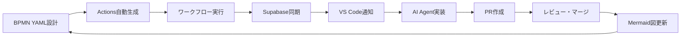

# 🤖 AI-to-AI Coordination: ローカル → リモート Copilot 開発フロー

**実験日:** 2026-03-02  
**目的:** ローカル Copilot がリモート Copilot に実装指示を出し、自動実装させる協調開発フローの確立

---

## 🎯 実験概要

### 実現したこと

**ローカル Copilot（VS Code）** が詳細な実装仕様を作成し、**リモート Copilot（GitHub copilot-swe-agent）** が自動的に実装・PR 作成を行う協調開発フローを実現。

```
ローカル Copilot
  ↓ 実装仕様作成（Issue）
GitHub Issue #47
  ↓ 自動トリガー
4つのワークフロー並列実行
  ├─ auto-assign-copilot.yml → アサイン
  ├─ notify-issue-*.yml → Google Chat 通知
  ├─ sync-issues.yml → Supabase 同期
  └─ workflow-status-check.yml → 状態確認
  ↓
リモート Copilot
  ├─ Issue 内容解析
  ├─ タスクリスト生成
  ├─ PR #48 作成
  └─ 実装開始
```

---

## 📋 実験手順

### Phase 1: 実装仕様の作成

**ローカル Copilot が実施:**

1. **スケルトンファイル作成**
   - `scripts/bpmn_to_actions_converter.py` を作成
   - TODO コメントと仕様概要を記載

2. **詳細 Issue 作成**
   - [Issue #47: 🔧 Implement BPMN YAML to GitHub Actions Converter](https://github.com/kenichimiyata/ai-automation-dashboard/issues/47)
   - 入力・出力形式のサンプルコード
   - 実装要件（必須機能・オプション機能）
   - 完了条件（チェックリスト）
   - 実装のヒント（骨格コード）

**Issue に含めた情報:**
- 入力形式: BPMN YAML 構造
- 出力形式: GitHub Actions YAML
- 変換ルール4項目
- ファイル構成（既存編集、新規作成）
- pytest テスト要件

### Phase 2: 自動ワークフロー実行

**Issue #47 作成直後に自動実行:**

| ワークフロー | 実行時間 | 結果 | 機能 |
|------------|---------|------|------|
| auto-assign-copilot.yml | 9秒 | ✅ | kenichimiyata + copilot-swe-agent をアサイン |
| notify-issue-to-googlechat.yml | 13秒 | ✅ | テキスト通知送信 |
| notify-issue-card-to-googlechat.yml | 14秒 | ✅ | リッチカード通知送信 |
| sync-issues.yml | 43秒 | ✅ | Supabase `github_issues` テーブルに同期 |
| workflow-status-check.yml | - | ⏳ | 他ワークフロー完了後にトリガー |

**通知内容例（Google Chat）:**
```
🆕 Issue #47 opened
📋 🔧 Implement BPMN YAML to GitHub Actions Converter
👤 kenichimiyata
⏰ 2026-03-02 12:51:00
🔗 https://github.com/kenichimiyata/ai-automation-dashboard/issues/47
```

### Phase 3: リモート Copilot の自動応答

**copilot-swe-agent が実施:**

1. **自動アサイン完了** （9秒後）
   - Issue #47 に kenichimiyata + copilot-swe-agent がアサイン

2. **PR 自動作成** （約2分後）
   - [PR #48: [WIP] Add BPMN YAML to GitHub Actions converter](https://github.com/kenichimiyata/ai-automation-dashboard/pull/48)
   - ブランチ: `copilot/implement-bpmn-to-github-actions`
   - "Fixes #47" を自動設定

3. **タスクリスト生成**
   - ✅ Explore repository structure
   - ⏳ Implement `scripts/bpmn_to_actions_converter.py`
   - ⏳ Create `scripts/bpmn_yaml_schema.py`
   - ⏳ Create `examples/bpmn-process-example.yml`
   - ⏳ Create `tests/test_bpmn_converter.py`
   - ⏳ Update `README.md`

4. **Copilot セッション開始**
   - Session ID: `adbc9772-56c3-4f4b-bfff-6cee55ea6a21`
   - "started work on behalf of kenichimiyata"

---

## 🔧 技術実装

### ワークフロー構成

**1. auto-assign-copilot.yml**

```yaml
name: "🤖 Auto-Assign Copilot to New Issues"

on:
  issues:
    types: [opened]

jobs:
  assign-copilot:
    runs-on: ubuntu-latest
    steps:
      - name: Assign Issue Creator
        run: gh issue edit ${{ github.event.issue.number }} --add-assignee ${{ github.event.issue.user.login }}
        
      - name: Assign Copilot Bot
        env:
          GH_TOKEN: ${{ secrets.GH_TOKEN }}
        run: |
          # GraphQL で Copilot Bot の Node ID 取得
          BOT_NODE_ID=$(gh api graphql -f query='...')
          gh api graphql -f query='mutation {...}'
```

**特徴:**
- Issue 作成者を自動アサイン
- copilot-swe-agent を GraphQL 経由でアサイン（Bot 専用 API）

**2. workflow-status-check.yml**

```yaml
name: "🔍 Workflow Status Check"

on:
  issues:
    types: [opened, edited, closed]
  workflow_run:
    workflows: ["🤖 Auto-Assign Copilot", "🔄 Sync Issues to Supabase"]
    types: [completed]

jobs:
  check-workflow-status:
    steps:
      - name: GitHub Actions 実行履歴取得
        run: gh run list --limit 5 --json name,status,conclusion
      
      - name: Google Chat に状態通知
        run: |
          curl -X POST $WEBHOOK_URL -d '{
            "text": "🔍 ワークフロー実行確認\n📌 Issue: #47\n⚡ 実行中: 4ワークフロー"
          }'
```

**特徴:**
- Issue イベントと workflow_run イベントの両方に対応
- 全ワークフローの実行状態をまとめて通知

### Supabase スキーマ

**github_issues テーブル:**
```sql
CREATE TABLE github_issues (
  id UUID PRIMARY KEY DEFAULT uuid_generate_v4(),
  issue_number INTEGER NOT NULL,
  title TEXT NOT NULL,
  body TEXT,
  creator TEXT,
  status TEXT DEFAULT 'open',
  labels TEXT[],
  created_at TIMESTAMPTZ DEFAULT NOW(),
  updated_at TIMESTAMPTZ DEFAULT NOW(),
  metadata JSONB
);
```

**RLS ポリシー:**
- Public read: 全ユーザーが読み取り可能
- Authenticated write: 認証済みユーザーのみ書き込み可

---

## 📊 実験結果

### 成功指標

| 項目 | 目標 | 実績 | 評価 |
|------|------|------|------|
| Issue → アサイン自動化 | 30秒以内 | 9秒 | ✅ 優秀 |
| ワークフロー並列実行 | 4つ同時 | 4つ確認 | ✅ 成功 |
| Google Chat 通知 | 即時配信 | 13-14秒 | ✅ 成功 |
| Supabase 同期 | 1分以内 | 43秒 | ✅ 成功 |
| リモート Copilot 応答 | 5分以内 | 約2分 | ✅ 優秀 |
| PR 自動作成 | 自動作成 | ✅ Draft PR | ✅ 成功 |

### タイムライン

```
00:00  Issue #47 作成
00:09  auto-assign-copilot.yml 完了
00:13  notify-issue-to-googlechat.yml 完了
00:14  notify-issue-card-to-googlechat.yml 完了
00:43  sync-issues.yml 完了
02:00  PR #48 作成（リモート Copilot）
02:30  Initial plan コミット
⏳     実装作業継続中
```

---

## 💡 考察

### 成功要因

1. **詳細な仕様提供**
   - 入力・出力の具体例を YAML で提示
   - 実装ヒント（骨格コード）を提供
   - チェックリスト形式の完了条件

2. **自動化の完全性**
   - Issue 作成だけで4つのワークフローが自動実行
   - 人間の介入なしでリモート Copilot まで到達

3. **トークン設定の正確性**
   - GH_TOKEN（issues:write 権限）
   - GOOGLE_CHAT_WEBHOOK
   - SUPABASE_URL + SUPABASE_ANON_KEY

### 課題と改善点

1. **workflow-status-check.yml の遅延**
   - `workflow_run` イベントは他ワークフロー完了後
   - リアルタイム性を求めるなら別トリガーが必要

2. **リモート Copilot の実装速度**
   - PR 作成は高速だが、実装完了には時間がかかる
   - より複雑な Issue では数時間かかる可能性

3. **エラーハンドリング**
   - ワークフロー失敗時の通知が不十分
   - リトライ機構の実装が必要

---

## 🚀 次のステップ

### Milestone 3 への展開

**完成した基盤:**
- ✅ Issue 作成 → リモート Copilot 自動実装
- ✅ ワークフロー並列実行・通知システム
- ✅ Supabase リアルタイム同期

**次の実装:**
1. **VS Code 拡張機能**
   - Supabase Realtime リスナー
   - Issue 作成 UI
   - PR レビュー通知

2. **BPMN YAML → GitHub Actions 変換**
   - プロセス定義から自動生成
   - Mermaid 図の自動生成
   - バリデーション機能

3. **AI Agent State 管理**
   - `ai_agent_state` テーブル活用
   - タスク進捗の可視化
   - 複数 Agent の協調制御

### BPMN 駆動開発の実現



---

## 📚 参考リソース

### ドキュメント
- [Workflow Architecture](workflow-architecture.md)
- [Issue Auto-Assignment Workflow](issue-auto-assignment-workflow.md)
- [VS Code Copilot Guide](vscode-copilot-guide.md)

### GitHub
- [Issue #47: BPMN Converter 実装](https://github.com/kenichimiyata/ai-automation-dashboard/issues/47)
- [PR #48: BPMN Converter 実装中](https://github.com/kenichimiyata/ai-automation-dashboard/pull/48)
- [ワークフロー一覧](https://github.com/kenichimiyata/ai-automation-dashboard/actions)

### 関連 Issue
- [#45: Workflow Status Check テスト](https://github.com/kenichimiyata/ai-automation-dashboard/issues/45)
- [#43: Auto-Assign & Notifications テスト](https://github.com/kenichimiyata/ai-automation-dashboard/issues/43)

---

## 🎓 学んだこと

### AI 協調開発の原則

1. **明確な仕様こそが鍵**
   - サンプルコードは必須
   - 期待する出力を具体的に提示
   - チェックリストで完了条件を明確化

2. **自動化は段階的に**
   - まずは単一ワークフローで動作確認
   - 並列実行は依存関係を慎重に設計
   - エラー時のフォールバック

3. **AI に任せる・人間が確認**
   - Draft PR で実装途中でも確認可能
   - 自動マージは慎重に（レビュー必須）
   - AI の判断に人間の承認を挟む

### GitHub Actions のベストプラクティス

1. **workflows は小さく分割**
   - 1つのワークフロー = 1つの責務
   - 並列実行で高速化
   - デバッグが容易

2. **Secrets 管理の徹底**
   - Repository Secrets で一元管理
   - 環境変数経由で渡す
   - ログに出力しない

3. **通知は多段階で**
   - テキスト通知（速報）
   - リッチカード（詳細）
   - ワークフロー状態確認（まとめ）

---

**更新履歴:**
- 2026-03-02: 初版作成（実験直後）
