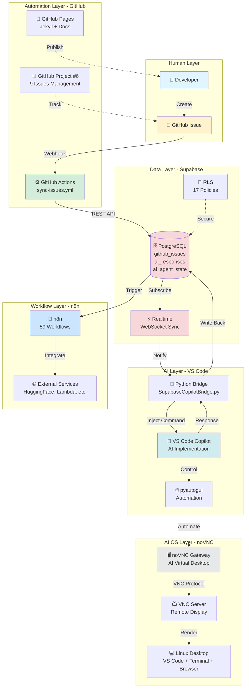
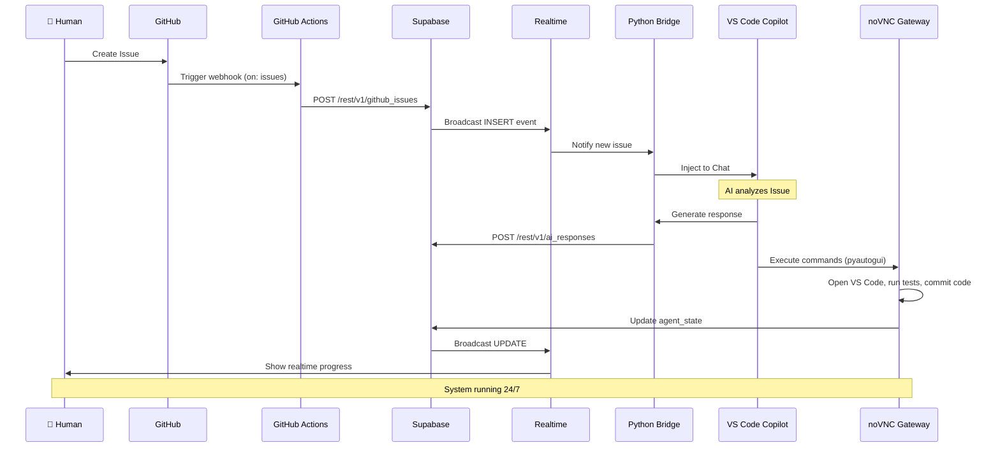
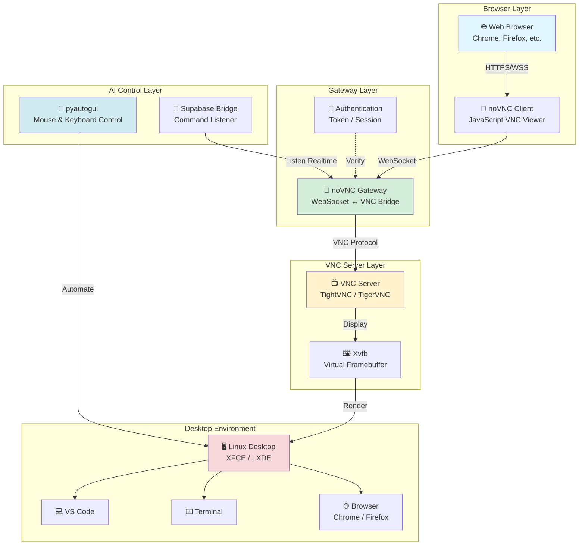
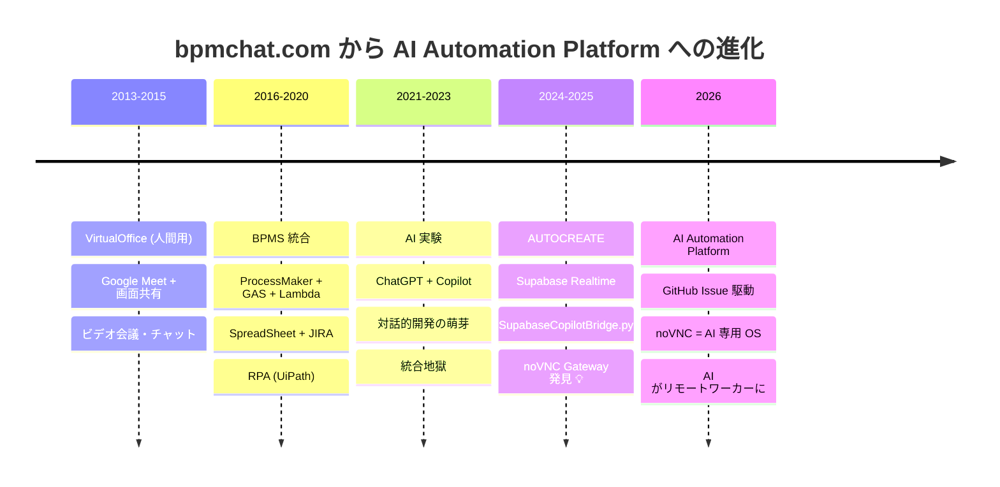

# 🏗️ Architecture Diagrams

## System Architecture - 全体構成

---

## Data Flow - Issue から完成まで

---

## noVNC Gateway Architecture - AI 用 OS

**説明:**
- **Browser Layer**: 人間が見る画面（どこからでもアクセス可能）
- **Gateway Layer**: WebSocket と VNC の変換・認証
- **VNC Server**: リモートデスクトップのサーバー
- **Desktop Environment**: AI が操作する実際のデスクトップ
- **AI Control Layer**: Supabase からの指示を受けて自動操作

---

## Evolution Timeline - VirtualOffice から noVNC Gateway へ

---

## Tech Stack Overview

| Layer | Technology | Purpose |
|-------|-----------|---------|
| **Frontend** | GitHub Pages (Jekyll) | Documentation |
| **Issue Tracking** | GitHub Issues + Project #6 | Task Management |
| **Pipeline** | GitHub Actions | Automation |
| **Database** | Supabase PostgreSQL | Data Storage |
| **Realtime** | Supabase Realtime | WebSocket Sync |
| **Security** | Row Level Security (RLS) | Access Control |
| **AI Interface** | VS Code Copilot | AI Implementation |
| **Bridge** | Python (pyautogui) | Automation |
| **AI OS** | noVNC Gateway | Virtual Desktop |
| **Workflow** | n8n | External Integration |
| **Visualization** | dhtmlx, Mermaid | BPMN Diagrams |

---

[← Back to Docs](index)
