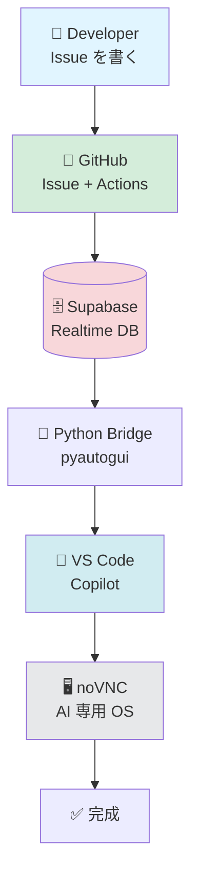

# AI Automation Platform

GitHub Issue を書くだけで AI が自動実装する、オープンソースの AI 自動化プラットフォームです。

## What is this?

A system that automatically:
1. Detects new GitHub Issues
2. Syncs them to Supabase (PostgreSQL + Realtime)
3. Notifies VS Code Copilot Chat for AI-assisted responses
4. Writes responses back to Supabase for tracking

## Quick Links

- **[🏗️ Architecture Diagrams](architecture-diagram)** - システム全体図・データフロー・noVNC Gateway ⭐ NEW
- [Architecture](architecture) - 技術詳細
- [Milestone 1 - Supabase Setup](milestone-1)
- [Milestone 2 - GitHub Actions](milestone-2)
- [Milestone 3 - VS Code Extension](milestone-3)
- [Setup Guide](setup)

## 📊 Visual Overview

**システムアーキテクチャ:**

**詳細は [Architecture Diagrams](architecture-diagram) へ**

## 📚 Knowledge Base (Wiki)

| ページ | 内容 |
|--------|------|
| **[10年の歴史](wiki/history)** | **📜 2013-2026年 - bpmchat.com から AI 自動化へ** ⭐ NEW |
| **[Copilot 協働実践例](wiki/copilot-workflow-example)** | **🎯 実際のやり取り・スクリーンショット自動化・Mermaid図** ⭐ NEW |
| [Repository Guide](wiki/repository-guide) | 📁 リポジトリ構成・使い分け完全ガイド |
| [Implementation Plan](implementation-plan) | 📋 実装計画書（Milestone 1-3） |
| [ナレッジベース一覧](wiki/) | wiki トップ |
| [プラットフォーム状態](wiki/platform-status) | 現在の進捗 |
| [クイックスタート](wiki/quick-start-guide) | 30分で環境構築 |
| [システム設計](wiki/system-architecture) | アーキテクチャ詳細 |
| [AI 協働開発](wiki/ai-collaboration-guide) | AI と人間の開発哲学 |
| [継続開発ガイド](wiki/continuity-guide) | AI 記憶引き継ぎ |
| [Tech Stack 全体図](wiki/tech-stack-architecture) | Mermaid アーキテクチャ図・全サービス一覧 |

## 🤝 仲間募集

[プロジェクトに参加する →](contributing)

AI エンジニア・フロントエンド・ドキュメント・アイデアマン、どなたでも歓迎です！

---

[GitHub](https://github.com/kenichimiyata/ai-automation-dashboard) |
[Roadmap](https://github.com/users/kenichimiyata/projects/6) |
[仲間募集](contributing)
