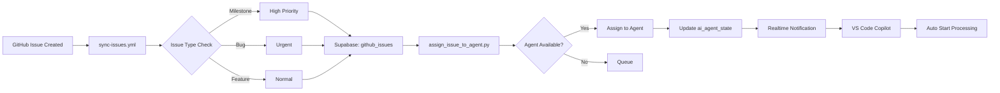

# 🤖 Issue 自動割り当てワークフロー（PDCA）

**作成日:** 2026-03-02  
**対象:** Milestone 3 - VS Code Copilot Bridge Extension

## 📋 概要

GitHub Issue が作成されたときに、AI Agent（VS Code Copilot）に自動的に割り当てる仕組みを構築します。

**目的:**
- Issue 作成 → 自動的に適切な AI Agent に割り当て
- Agent の稼働状態を `ai_agent_state` テーブルで管理
- VS Code にリアルタイム通知して自動処理開始

---

## 🔄 PDCA サイクル

### 📝 Plan（計画）

#### 1. システム設計



#### 2. データベース構造

**ai_agent_state テーブル:**
```sql
CREATE TABLE ai_agent_state (
  id UUID PRIMARY KEY DEFAULT uuid_generate_v4(),
  agent_id TEXT UNIQUE NOT NULL,
  agent_name TEXT,
  current_task UUID REFERENCES github_issues(id),
  status TEXT CHECK (status IN ('idle', 'busy', 'offline')),
  progress INTEGER DEFAULT 0,
  last_update TIMESTAMP DEFAULT NOW(),
  metadata JSONB
);
```

**github_issues テーブル（拡張）:**
```sql
ALTER TABLE github_issues
ADD COLUMN assigned_agent TEXT REFERENCES ai_agent_state(agent_id),
ADD COLUMN assigned_at TIMESTAMP;
```

#### 3. ワークフロー設計

**GitHub Actions ジョブ構成:**
1. ✅ Issue種別判定
2. ✅ Milestone/Bug/通常処理
3. ✅ Supabase同期
4. 🆕 **AI Agent割り当て** ← NEW!
5. ✅ Google Chat通知
6. ✅ VS Code通知

#### 4. Agent 割り当てロジック

**優先度ルール:**
- Milestone Issue → 優先度: 高
- Bug Issue → 優先度: 緊急
- Feature Issue → 優先度: 通常

**割り当てアルゴリズム:**
```python
def assign_issue_to_agent(issue_id, priority):
    # 1. idle 状態の Agent を検索
    agents = get_idle_agents()
    
    if agents:
        # 2. 最も最近 idle になった Agent を選択
        agent = agents[0]
        
        # 3. Agent に Issue を割り当て
        update_agent_state(agent.id, issue_id, 'busy')
        
        # 4. github_issues に Agent を記録
        update_issue_assignment(issue_id, agent.id)
        
        return agent.id
    else:
        # 5. 全 Agent が busy の場合はキューに追加
        add_to_queue(issue_id, priority)
        return None
```

---

### 🚀 Do（実行）

#### タスク1: スクリプト作成

**ファイル:** `ai-automation-dashboard/scripts/assign_issue_to_agent.py`

```python
"""
GitHub Issue を AI Agent に自動割り当て
"""
import os
import sys
from datetime import datetime
from supabase import create_client, Client

SUPABASE_URL = os.getenv('SUPABASE_URL')
SUPABASE_KEY = os.getenv('SUPABASE_ANON_KEY')

supabase: Client = create_client(SUPABASE_URL, SUPABASE_KEY)

def get_idle_agents():
    """idle 状態の Agent を取得"""
    response = supabase.table('ai_agent_state')\
        .select('*')\
        .eq('status', 'idle')\
        .order('last_update', desc=False)\
        .execute()
    return response.data

def assign_to_agent(issue_id: str, issue_number: int, priority: str):
    """Issue を Agent に割り当て"""
    agents = get_idle_agents()
    
    if not agents:
        print('⚠️ 利用可能な Agent がありません。キューに追加します。')
        return None
    
    agent = agents[0]
    agent_id = agent['agent_id']
    
    print(f'🤖 Agent: {agent_id} に Issue #{issue_number} を割り当て')
    
    # Agent の状態を更新
    supabase.table('ai_agent_state').update({
        'current_task': issue_id,
        'status': 'busy',
        'last_update': datetime.now().isoformat()
    }).eq('agent_id', agent_id).execute()
    
    # Issue に Agent を記録
    supabase.table('github_issues').update({
        'assigned_agent': agent_id,
        'assigned_at': datetime.now().isoformat()
    }).eq('id', issue_id).execute()
    
    print(f'✅ 割り当て完了')
    return agent_id

if __name__ == '__main__':
    if len(sys.argv) < 4:
        print('Usage: python assign_issue_to_agent.py <issue_id> <issue_number> <priority>')
        sys.exit(1)
    
    issue_uuid = sys.argv[1]
    issue_num = int(sys.argv[2])
    issue_priority = sys.argv[3]
    
    agent = assign_to_agent(issue_uuid, issue_num, issue_priority)
    sys.exit(0 if agent else 1)
```

#### タスク2: ワークフロー拡張

**ファイル:** `ai-automation-dashboard/.github/workflows/sync-issues.yml`

**追加するジョブ:**
```yaml
  # ステップ4: AI Agent割り当て
  assign-to-agent:
    name: "🤖 AI Agent割り当て"
    needs: [check-issue-type, sync-to-supabase]
    runs-on: ubuntu-latest
    env:
      SUPABASE_URL: ${{ secrets.SUPABASE_URL }}
      SUPABASE_ANON_KEY: ${{ secrets.SUPABASE_ANON_KEY }}
    steps:
      - name: Checkout
        uses: actions/checkout@v4
      
      - name: Python環境セットアップ
        uses: actions/setup-python@v5
        with:
          python-version: '3.11'
      
      - name: supabase-pyインストール
        run: pip install supabase
      
      - name: Issue種別から優先度決定
        id: priority
        run: |
          IS_MILESTONE="${{ needs.check-issue-type.outputs.is_milestone }}"
          IS_BUG="${{ needs.check-issue-type.outputs.is_bug }}"
          
          if [ "$IS_MILESTONE" = "true" ]; then
            echo "priority=high" >> $GITHUB_OUTPUT
          elif [ "$IS_BUG" = "true" ]; then
            echo "priority=urgent" >> $GITHUB_OUTPUT
          else
            echo "priority=normal" >> $GITHUB_OUTPUT
          fi
      
      - name: AI Agentに割り当て
        run: |
          # Supabaseから issue_id (UUID) を取得
          ISSUE_ID=$(curl -s -X GET \
            -H "apikey: ${{ env.SUPABASE_ANON_KEY }}" \
            -H "Authorization: Bearer ${{ env.SUPABASE_ANON_KEY }}" \
            "${{ env.SUPABASE_URL }}/rest/v1/github_issues?issue_number=eq.${{ needs.check-issue-type.outputs.issue_number }}&select=id" \
            | jq -r '.[0].id')
          
          echo "📋 Issue UUID: $ISSUE_ID"
          
          # スクリプト実行
          python scripts/assign_issue_to_agent.py \
            "$ISSUE_ID" \
            "${{ needs.check-issue-type.outputs.issue_number }}" \
            "${{ steps.priority.outputs.priority }}"
```

#### タスク3: テストデータ準備

**ai_agent_state サンプルデータ:**
```sql
INSERT INTO ai_agent_state (agent_id, agent_name, status) VALUES
('copilot-01', 'VS Code Copilot #1', 'idle'),
('copilot-02', 'VS Code Copilot #2', 'idle'),
('copilot-03', 'VS Code Copilot #3', 'offline');
```

---

### ✅ Check（評価）

#### 1. 動作確認項目

**テストケース:**

| # | テスト内容 | 期待結果 | 確認方法 |
|---|----------|---------|---------|
| 1 | idle Agent が存在する場合 | Issue が Agent に割り当てられる | Supabase `ai_agent_state` テーブル確認 |
| 2 | 全 Agent が busy の場合 | キューに追加される | ログ出力確認 |
| 3 | Milestone Issue | 優先度 high で処理 | priority パラメータ確認 |
| 4 | Bug Issue | 優先度 urgent で処理 | priority パラメータ確認 |
| 5 | Realtime 通知 | VS Code に通知が届く | VS Code 側で受信確認 |

#### 2. 確認コマンド

**Agent 状態確認:**
```sql
SELECT agent_id, agent_name, status, current_task, last_update
FROM ai_agent_state
ORDER BY last_update DESC;
```

**割り当て済み Issue 確認:**
```sql
SELECT issue_number, title, assigned_agent, assigned_at
FROM github_issues
WHERE assigned_agent IS NOT NULL
ORDER BY assigned_at DESC;
```

#### 3. 成功基準

- ✅ Issue 作成後 1分以内に Agent 割り当て完了
- ✅ `ai_agent_state` の status が idle → busy に変更
- ✅ `github_issues` の assigned_agent が記録される
- ✅ VS Code に Realtime 通知が届く
- ✅ 全 Agent が busy の場合、エラーにならずキュー処理

---

### 🔧 Action（改善）

#### 改善ポイント

1. **Agent 負荷分散**
   - 現在: 最も古い idle Agent を選択
   - 改善: Agent の処理済み Issue 数でバランシング

2. **キュー管理**
   - 現在: キューに追加するだけ
   - 改善: 優先度順キュー + Agent が idle になったら自動割り当て

3. **Agent オフライン検知**
   - 現在: 手動で offline 設定
   - 改善: ハートビート監視 + 自動 offline 設定

4. **通知強化**
   - 現在: VS Code に通知のみ
   - 改善: Google Chat/Slack にも Agent 割り当て通知

#### 次のステップ

- [ ] キュー管理システムの実装
- [ ] Agent ハートビート監視
- [ ] ダッシュボード UI（Agent 稼働状況可視化）
- [ ] Agent 処理結果の自動コミット機能

---

## 📚 参考資料

- [Milestone 3 実装計画](implementation-plan.md)
- [Supabase Schema](../supabase/schema.sql)
- [GitHub Actions ワークフロー](https://github.com/kenichimiyata/ai-automation-dashboard/blob/main/.github/workflows/sync-issues.yml)

---

[Back to Documentation](.)
