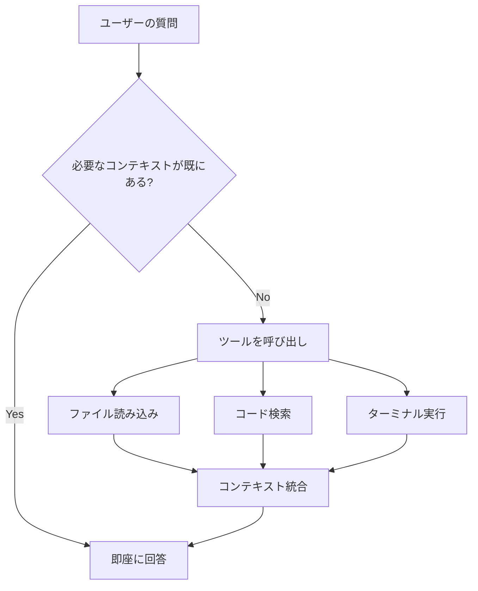

# VS Code Copilot 完全ガイド

**最終更新**: 2026-02-28  
**対象**: VS Code GitHub Copilot Chat (Edits モード)

---

## 📚 目次

1. [概要](#概要)
2. [Cloud vs Local](#cloud-vs-local)
3. [CLI との違い](#cli-との違い)
4. [コンテキスト取得の仕組み](#コンテキスト取得の仕組み)
5. [リポジトリ横断機能](#リポジトリ横断機能)
6. [VS Code 設定](#vs-code-設定)
7. [推奨ワークフロー](#推奨ワークフロー)

---

## 概要

GitHub Copilot Chat は、VS Code 内で動作する AI コーディングアシスタントです。単なるコード補完を超え、複雑なタスクの自動実行、ファイル編集、リファクタリング、デバッグをサポートします。

### 主な機能

- ✅ **ファイル操作**: 読み込み・編集・作成・削除
- ✅ **コードベース理解**: 複数リポジトリの横断検索
- ✅ **ターミナル実行**: コマンド実行・結果取得
- ✅ **長期記憶**: 会話履歴・プロジェクト状態の記憶
- ✅ **エラー診断**: 自動エラー検出・修正提案

---

## Cloud vs Local

### 🌐 Cloud モード (推奨)

**実行環境**: GitHub のサーバー  
**モデル**: Claude Sonnet 4.5 など大規模モデル

#### メリット
- ✅ 複雑な問題の理解力が高い
- ✅ 長い会話の文脈を正確に記憶
- ✅ 多数のファイル・依存関係の統合理解
- ✅ エッジケースの考慮が丁寧
- ✅ より洗練されたコード生成

#### デメリット
- ⚠️ ネットワーク遅延（数秒程度）
- ⚠️ インターネット接続が必要

### 💻 Local モード

**実行環境**: VS Code プロセス内  
**モデル**: 軽量モデル

#### メリット
- ✅ レスポンスが速い
- ✅ オフラインで動作
- ✅ 簡単なタスクには十分

#### デメリット
- ⚠️ 複雑なタスクで判断ミスの可能性
- ⚠️ 長い会話で文脈を忘れやすい
- ⚠️ アーキテクチャ設計に弱い

### 📊 比較表

| タスク | Local | Cloud |
|--------|-------|-------|
| 簡単なコード補完 | ⭐⭐⭐⭐⭐ | ⭐⭐⭐⭐⭐ |
| 複雑なリファクタリング | ⭐⭐⭐ | ⭐⭐⭐⭐⭐ |
| アーキテクチャ設計 | ⭐⭐ | ⭐⭐⭐⭐⭐ |
| 多数ファイルの統合編集 | ⭐⭐⭐ | ⭐⭐⭐⭐⭐ |
| 緊急の小さな修正 | ⭐⭐⭐⭐⭐ | ⭐⭐⭐⭐ |

### 🎯 推奨使用方法

| プロジェクト規模 | 推奨モード |
|-----------------|-----------|
| 単一ファイルの簡単な修正 | Local でも十分 |
| 複数リポジトリの統合プロジェクト | **Cloud 推奨** |
| アーキテクチャ設計・新機能実装 | **Cloud 推奨** |
| 緊急のバグ修正（簡単） | Local（速い） |

---

## CLI との違い

### 🖥️ GitHub Copilot CLI (`gh copilot`)

**実行場所**: ターミナル・コマンドライン

```bash
# インストール
gh extension install github/gh-copilot

# 使用例
gh copilot suggest "ファイルを再帰的に削除"
gh copilot explain "git rebase -i HEAD~3"
```

#### 特徴
- ✅ シェルコマンドの提案・説明に特化
- ✅ ターミナルから直接実行
- ✅ Git操作の説明
- ❌ ファイル編集不可
- ❌ コードベース全体の理解は限定的

### 💬 VS Code Copilot Chat

**実行場所**: VS Code エディタ内

#### 特徴
- ✅ ファイル読み込み・編集
- ✅ コードベース全体の理解
- ✅ 複雑なタスクの実行
- ✅ ワークスペース統合
- ✅ 長い会話・コンテキスト記憶

### 📊 比較表

| 項目 | CLI | VS Code Chat |
|------|-----|--------------|
| **用途** | コマンド提案 | 開発全般 |
| **ファイル編集** | ❌ | ✅ |
| **コンテキスト** | 限定的 | ワークスペース全体 |
| **実行環境** | ターミナル | VS Code |
| **複雑なタスク** | ❌ | ✅ |

**結論**: CLI は「コマンドヘルパー」、VS Code Chat は「開発アシスタント」

---

## コンテキスト取得の仕組み

### ✅ 自動で読み込まれるもの

1. **ワークスペース構造** - ファイル名・フォルダ名のリスト
2. **現在開いているファイル** - エディタで表示中の内容
3. **リポジトリ情報** - ブランチ名、オーナー名
4. **ユーザーメモリ** - 最初の200行（`/memories/`）

### ❌ 自動では読み込まれないもの

- 閉じているファイルの内容
- 各ファイルのコード詳細
- 大量のファイル群

### 🤖 AI の動作原理

**重要**: AI は質問に答えるために必要だと判断すると、**自分でツールを呼び出してファイルを読み込みます**。

#### 利用可能なツール

| ツール | 用途 |
|--------|------|
| `read_file` | 特定ファイルを読む |
| `grep_search` | コード検索 |
| `semantic_search` | 意味的な検索 |
| `file_search` | ファイル名検索 |
| `replace_string_in_file` | ファイル編集 |
| `run_in_terminal` | コマンド実行 |

#### 動作例

```
ユーザー: 「README.mdの内容は?」
AI: read_file を自動実行 → 内容を返答

ユーザー: 「GitHub Actionsの設定は?」
AI: file_search → grep_search → read_file → 内容を分析

ユーザー: 「エラーを修正して」
AI: get_errors → read_file → replace_string_in_file
```

### 📊 処理フロー



---

## リポジトリ横断機能

### 🔄 複数リポジトリの統合管理

VS Code のワークスペースに複数のリポジトリが含まれている場合、**全てのリポジトリを横断してアクセス可能**です。

### ✅ 可能な操作

```
✅ 横断検索
✅ 複数リポジトリのファイル編集
✅ リポジトリ間の関連性分析
✅ 同時に複数リポジトリのファイルを操作
```

### 💡 実例

ワークスペース構成:

```
c:\xampp\htdocs\
├── ai-automation-platform/ (bpmbox)
│   ├── README.md
│   ├── supabase/schema.sql
│   └── n8n_workflows/
├── ai-automation-dashboard/ (kenichimiyata)
│   ├── .github/workflows/sync-issues.yml
│   └── scripts/
├── ai-automation-docs/ (kenichimiyata)
│   └── docs/
└── localProject/ (kenichimiyata)
    └── AUTOCREATE.wiki/
```

#### 横断操作の例

```
質問: "Supabaseのスキーマとワークフローの整合性をチェックして"

AI の動作:
1. ai-automation-platform/supabase/schema.sql を読む
2. ai-automation-dashboard/.github/workflows/ を検索
3. 両方を分析して不整合を報告
```

### 🔍 横断検索ツール

| ツール | スコープ |
|--------|----------|
| `grep_search` | ワークスペース全体（全リポジトリ） |
| `semantic_search` | 全リポジトリから意味的に検索 |
| `file_search` | 全リポジトリのファイル名検索 |

### 🎯 適用例

#### 1. 複数リポジトリの統合開発

```
質問: "3つのリポジトリ全体で 'github_issues' テーブルを使っている箇所を探して"

AI: 全リポジトリの .sql, .py, .yml ファイルを横断検索
```

#### 2. ドキュメントとコードの同期

```
質問: "READMEと実際のコードの不一致を確認して"

AI: 
- docs リポジトリの README.md を読む
- platform リポジトリの実装を確認
- 差分を報告
```

#### 3. 設定ファイルの統一

```
質問: "全リポジトリの .env.example を統一して"

AI: 全リポジトリの設定ファイルを検索 → 編集
```

---

## VS Code 設定

### 📁 ワークスペース設定 (推奨)

**ファイル**: `.vscode/settings.json`

```json
{
  // ===== GitHub Copilot 設定 =====
  "github.copilot.enable": {
    "*": true,
    "yaml": true,
    "plaintext": false,
    "markdown": true
  },
  
  // Cloud モード優先
  "github.copilot.advanced": {
    "debug.overrideEngine": "claude-sonnet-4.5"
  },

  // Copilot Chat の動作
  "github.copilot.chat.welcomeMessage": "never",
  "github.copilot.chat.terminalChatLocation": "quickChat",
  
  // ===== エディタ設定 =====
  "editor.fontSize": 14,
  "editor.tabSize": 2,
  "editor.insertSpaces": true,
  "editor.formatOnSave": true,
  "editor.codeActionsOnSave": {
    "source.organizeImports": true
  },

  // ===== ファイル設定 =====
  "files.autoSave": "onFocusChange",
  "files.exclude": {
    "**/.git": true,
    "**/.DS_Store": true,
    "**/node_modules": true,
    "**/__pycache__": true,
    "**/*.pyc": true
  },

  // ===== 検索設定 =====
  "search.exclude": {
    "**/node_modules": true,
    "**/venv": true,
    "**/.venv": true,
    "**/dist": true,
    "**/build": true
  },

  // ===== Python 設定 =====
  "python.defaultInterpreterPath": "${workspaceFolder}/.venv/Scripts/python.exe",
  "python.linting.enabled": true,
  "python.linting.pylintEnabled": true,
  "python.formatting.provider": "black",

  // ===== Git 設定 =====
  "git.autofetch": true,
  "git.confirmSync": false,
  "git.enableSmartCommit": true,

  // ===== ターミナル設定 =====
  "terminal.integrated.defaultProfile.windows": "PowerShell",
  "terminal.integrated.fontSize": 13
}
```

### 🔧 ユーザー設定

**ファイル パス**: `%APPDATA%\Code\User\settings.json`  
**Windows**: `C:\Users\<USERNAME>\AppData\Roaming\Code\User\settings.json`

```json
{
  // グローバル Copilot 設定
  "github.copilot.enable": {
    "*": true
  },
  
  // 自動更新
  "update.mode": "default",
  
  // テレメトリ（任意）
  "telemetry.telemetryLevel": "off"
}
```

### 📦 推奨拡張機能

**ファイル**: `.vscode/extensions.json`

```json
{
  "recommendations": [
    // === AI 開発 ===
    "github.copilot",
    "github.copilot-chat",
    
    // === 言語サポート ===
    "ms-python.python",
    "ms-python.vscode-pylance",
    "dbaeumer.vscode-eslint",
    
    // === データベース ===
    "mtxr.sqltools",
    "mtxr.sqltools-driver-pg",
    
    // === Git ===
    "eamodio.gitlens",
    "github.vscode-pull-request-github",
    
    // === ユーティリティ ===
    "esbenp.prettier-vscode",
    "editorconfig.editorconfig",
    "bierner.markdown-mermaid",
    "yzhang.markdown-all-in-one"
  ]
}
```

### ⚙️ タスク設定

**ファイル**: `.vscode/tasks.json`

```json
{
  "version": "2.0.0",
  "tasks": [
    {
      "label": "Python: Run Current File",
      "type": "shell",
      "command": "${workspaceFolder}/.venv/Scripts/python.exe",
      "args": ["${file}"],
      "group": {
        "kind": "build",
        "isDefault": true
      },
      "presentation": {
        "reveal": "always",
        "panel": "new"
      }
    },
    {
      "label": "Supabase: Check Tables",
      "type": "shell",
      "command": "python",
      "args": ["${workspaceFolder}/ai-automation-platform/supabase/check_tables_simple.py"],
      "group": "test"
    },
    {
      "label": "Git: Sync All Repos",
      "type": "shell",
      "command": "python",
      "args": ["${workspaceFolder}/sync_github_issues.py"],
      "group": "none"
    }
  ]
}
```

### 🐛 デバッグ設定

**ファイル**: `.vscode/launch.json`

```json
{
  "version": "0.2.0",
  "configurations": [
    {
      "name": "Python: Current File",
      "type": "python",
      "request": "launch",
      "program": "${file}",
      "console": "integratedTerminal",
      "justMyCode": true,
      "env": {
        "PYTHONPATH": "${workspaceFolder}"
      }
    },
    {
      "name": "Python: Supabase Script",
      "type": "python",
      "request": "launch",
      "program": "${workspaceFolder}/ai-automation-platform/supabase/${fileBasenameNoExtension}.py",
      "console": "integratedTerminal",
      "envFile": "${workspaceFolder}/.env"
    }
  ]
}
```

---

## 推奨ワークフロー

### 🎯 効率的な Copilot 活用法

#### 1. プロジェクト開始時

```
1. ワークスペースに全リポジトリを追加
2. .vscode/settings.json を設定
3. メモリファイル (/memories/) に プロジェクト情報を記録
```

#### 2. 日常開発

```markdown
## 質問の仕方（Good Example）

❌ 悪い例: "エラーがある"
✅ 良い例: "ai-automation-platform/supabase/schema.sql の github_issues テーブルに RLS ポリシーを追加して"

❌ 悪い例: "ドキュメント更新"
✅ 良い例: "ai-automation-docs/docs/milestone-2.md に今日の進捗を追記して"
```

#### 3. 複雑なタスク

```
ステップ1: 全体像の確認を依頼
「3つのリポジトリ全体で Supabase 接続を使っている箇所を調査して」

ステップ2: 具体的な作業指示
「接続文字列を環境変数に統一して」

ステップ3: ドキュメント化
「変更内容を CHANGELOG.md に記録して」
```

#### 4. エラー対応

```
1. エラー発生
2. Copilot に該当ファイルを開いた状態で質問
   「このエラーを修正して」
3. 自動的に：
   - エラー箇所の特定
   - 関連ファイルの読み込み
   - 修正提案・実行
```

### 📊 タスク別推奨モード

| タスク | モード | 理由 |
|--------|--------|------|
| 新機能の実装 | **Cloud** | 複雑な設計判断が必要 |
| バグ修正（単純） | Local | 速度重視 |
| リファクタリング | **Cloud** | 多数ファイルの理解が必要 |
| ドキュメント作成 | **Cloud** | 長文生成・構造化が得意 |
| 設定ファイル編集 | Local | 単純作業 |
| データベーススキーマ設計 | **Cloud** | 複雑な関連性の理解 |

### 🔄 継続的な改善

```
1. メモリファイルを活用
   - /memories/ に よく使うコマンド・パターンを記録
   - /memories/session/ に 作業ログを保存

2. 設定の最適化
   - よく使うタスクを tasks.json に追加
   - プロジェクト固有の設定を記録

3. 学習と改善
   - Copilot の提案を評価
   - 誤った提案は明示的に訂正
```

---

## 🔗 関連リソース

### 公式ドキュメント

- [GitHub Copilot Docs](https://docs.github.com/en/copilot)
- [VS Code Copilot](https://code.visualstudio.com/docs/editor/github-copilot)

### プロジェクト内リソース

- [AI Automation Platform Architecture](architecture.md)
- [Implementation Plan](implementation-plan.md)
- [Project Structure](../PROJECT_STRUCTURE.md)

### ワークスペース設定例

```bash
# 推奨ワークスペース構成
c:\xampp\htdocs\
├── .vscode/              # このガイドの設定ファイル
├── .env                  # 環境変数
├── ai-automation-platform/
├── ai-automation-dashboard/
├── ai-automation-docs/
└── localProject/
```

---

## 📝 まとめ

### ✅ 重要ポイント

1. **Cloud モード推奨** - 複雑なプロジェクトでは必須
2. **リポジトリ横断可能** - ワークスペース全体を統合管理
3. **自動コンテキスト取得** - 必要なファイルを AI が自動読み込み
4. **適切な設定** - .vscode/ に設定を集約

### 🎯 次のステップ

1. `.vscode/settings.json` を設定
2. 推奨拡張機能をインストール
3. メモリファイルにプロジェクト情報を記録
4. 小さなタスクから Copilot を活用開始

---

**最終更新**: 2026-02-28  
**メンテナー**: kenichimiyata

