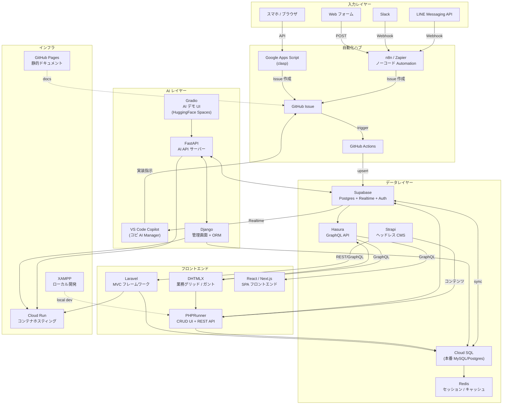
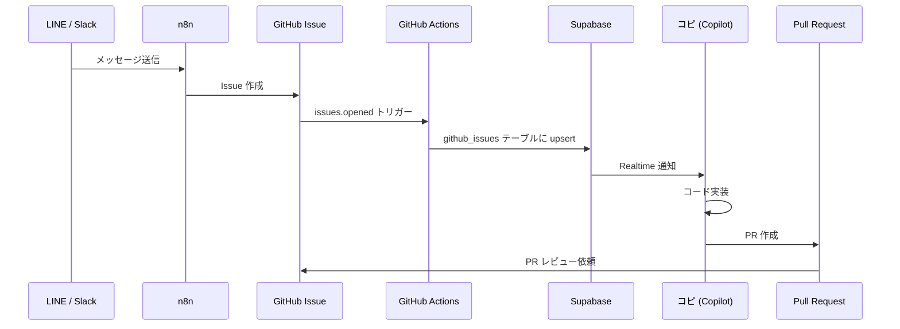
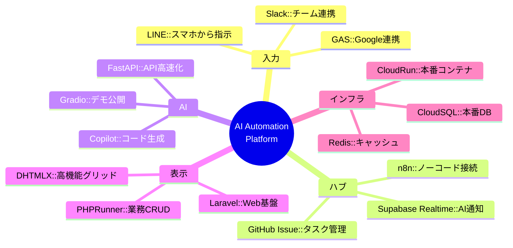

# Tech Stack & Architecture 全体図

**最終更新:** 2026-02-27

---

## 全体アーキテクチャ図

---

## サービス一覧

### フロントエンド / UI

| サービス | 用途 | 連携先 |
|--|--|--|
| **DHTMLX** | 業務グリッド・ガントチャート・スケジューラ | PHPRunner, Hasura GraphQL |
| **PHPRunner** | CRUD UI + REST API 自動生成 | MySQL, Supabase, Cloud SQL |
| **Laravel** | MVC フレームワーク・Web バックエンド | Cloud SQL, Strapi |
| **React / Next.js** | SPA フロントエンド | Hasura GraphQL, Supabase |

---

### データ / API レイヤー

| サービス | 用途 | 特徴 |
|--|--|--|
| **Supabase** | Postgres + Realtime + Auth + Storage | AI 連携のハブ。Realtime で VS Code に通知 |
| **Cloud SQL** | 本番 MySQL / Postgres | Cloud Run バックエンドの永続化 |
| **Hasura** | Postgres → GraphQL 自動生成 | Supabase/Cloud SQL に被せて GraphQL API 化 |
| **Strapi** | ヘッドレス CMS | コンテンツ管理（記事・お知らせ・商品説明）|
| **Redis** | セッション・キャッシュ | Cloud Run のステートレス補完 |

---

### AI レイヤー

| サービス | 用途 | 特徴 |
|--|--|--|
| **VS Code Copilot (コピ)** | AI マネージャー・コード生成 | GitHub Issue → 自動実装 → PR |
| **FastAPI** | AI API サーバー | Python, 高速, OpenAPI 自動生成 |
| **Django** | 管理画面 + ORM | FastAPI と組み合わせて管理 UI |
| **Gradio** | AI デモ UI | HuggingFace Spaces で公開 |

---

### 自動化 / 入力

| サービス | 用途 | 特徴 |
|--|--|--|
| **LINE Messaging API** | スマホから GitHub Issue を作成 | Webhook → n8n → Issue |
| **Google Apps Script (clasp)** | Google Workspace 連携・スプレッドシート自動化 | VS Code で開発・デプロイ |
| **n8n / Zapier** | ノーコード Automation | LINE, Slack, Supabase, GAS を繋ぐ |
| **GitHub Actions** | CI/CD・Issue トリガー自動化 | Issue → Supabase 同期 |
| **Slack** | チーム通知・Copilot への指示 | Webhook → n8n → Issue |

---

### インフラ

| サービス | 用途 | 特徴 |
|--|--|--|
| **Cloud Run** | コンテナホスティング (FastAPI, Django, Laravel) | サーバーレス、オートスケール |
| **GitHub Pages** | 静的ドキュメントサイト | ai-automation-docs 公開 |
| **XAMPP** | ローカル開発環境 | PHP + MySQL + Apache |

---

## データフロー詳細図

---

## 技術選定の理由

---

## 優先実装ロードマップ

| 優先度 | サービス | 理由 |
|--|--|--|
| 🔴 即時 | LINE → GitHub Issue | スマホから AI に指示できる |
| 🔴 即時 | clasp 公開サンプル | GAS Bridge の動作実証 |
| 🟡 次回 | Hasura on Supabase | DHTMLX GraphQL 接続 |
| 🟡 次回 | n8n セルフホスト | Cloud Run に n8n を立てる |
| 🟢 中期 | Strapi + PHPRunner | コンテンツ管理分離 |
| 🟢 中期 | Redis on Cloud Run | セッション管理 |
| 🔵 長期 | Gradio デモ展開 | AI 機能の外部公開 |

---

## 関連ページ

- [システムアーキテクチャ](System-Architecture)
- [Submodule 一覧](Submodule-List)
- [クイックスタート](Quick-Start-Guide)
- [プラットフォーム状態](AI-Automation-Platform-Status)
