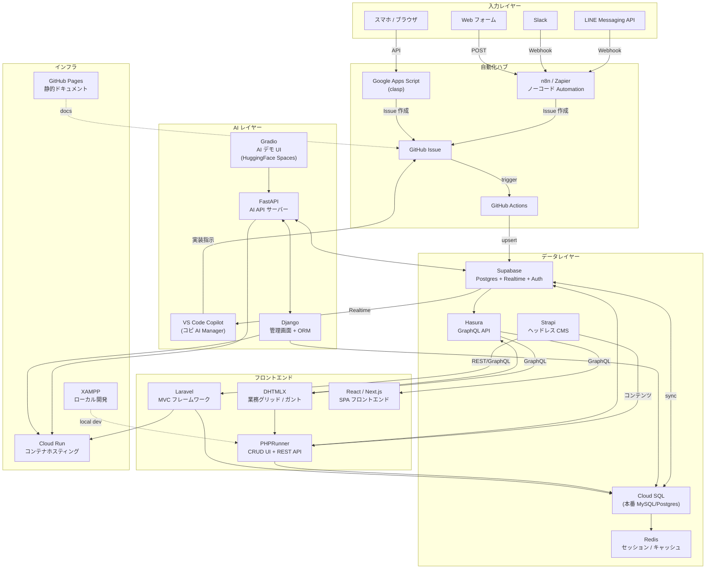
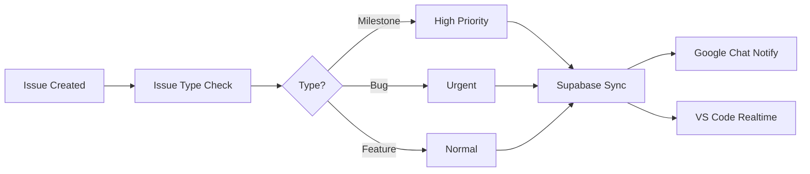
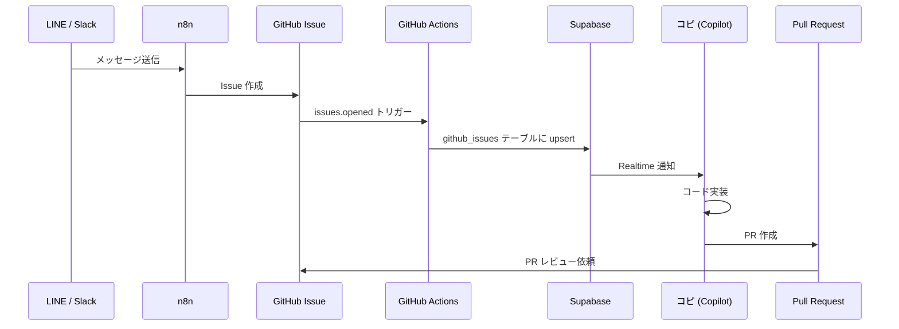
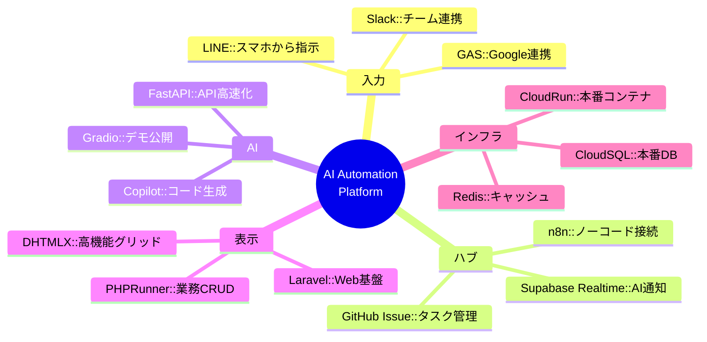

# Tech Stack & Architecture 全体図

**最終更新:** 2026-02-27

---

## 全体アーキテクチャ図



---

## サービス一覧

### フロントエンド / UI

| サービス | 用途 | 連携先 | URL |
|--|--|--|--|
| **DHTMLX** | 業務グリッド・ガントチャート・スケジューラ | PHPRunner, Hasura GraphQL | [dhtmlx.com](https://dhtmlx.com/) |
| **PHPRunner** | CRUD UI + REST API 自動生成 | MySQL, Supabase, Cloud SQL | [phprunner.com](https://xlinesoft.com/phprunner) |
| **Laravel** | MVC フレームワーク・Web バックエンド | Cloud SQL, Strapi | [laravel.com](https://laravel.com/) |
| **React / Next.js** | SPA フロントエンド | Hasura GraphQL, Supabase | [nextjs.org](https://nextjs.org/) |

---

### データ / API レイヤー

| サービス | 用途 | 特徴 | URL |
|--|--|--|--|
| **Supabase** | Postgres + Realtime + Auth + Storage | AI 連携のハブ。Realtime で VS Code に通知 | [Dashboard](https://supabase.com/dashboard/project/rootomzbucovwdqsscqd) |
| **Cloud SQL** | 本番 MySQL / Postgres | Cloud Run バックエンドの永続化 | - |
| **Hasura** | Postgres → GraphQL 自動生成 | Supabase/Cloud SQL に被せて GraphQL API 化 | - |
| **Strapi** | ヘッドレス CMS | コンテンツ管理（記事・お知らせ・商品説明）| - |
| **Redis** | セッション・キャッシュ | Cloud Run のステートレス補完 | - |

---

### AI レイヤー

| サービス | 用途 | 特徴 | URL |
|--|--|--|--|
| **VS Code Copilot (コピ)** | AI マネージャー・コード生成 | GitHub Issue → 自動実装 → PR | [GitHub Copilot](https://github.com/features/copilot) |
| **FastAPI** | AI API サーバー | Python, 高速, OpenAPI 自動生成 | [fastapi.tiangolo.com](https://fastapi.tiangolo.com/) |
| **Django** | 管理画面 + ORM | FastAPI と組み合わせて管理 UI | [djangoproject.com](https://www.djangoproject.com/) |
| **Gradio** | AI デモ UI | HuggingFace Spaces で公開 | [gradio.app](https://www.gradio.app/) |

---

### 自動化 / 入力

| サービス | 用途 | 特徴 | URL |
|--|--|--|--|
| **LINE Messaging API** | スマホから GitHub Issue を作成 | Webhook → n8n → Issue | - |
| **Google Apps Script (clasp)** | Google Workspace 連携・スプレッドシート自動化 | VS Code で開発・デプロイ | [BPMN Designer](https://script.google.com/a/macros/urlounge.co.jp/s/AKfycbzOFStOJRdYblPXloslKV0rDmzP24aO9uQuudQn_koE_ENnqdFfLX98svbyJOJ2Vx1_/exec) |
| **n8n / Zapier** | ノーコード Automation | LINE, Slack, Supabase, GAS を繋ぐ | [n8n on HF](https://kenken999-n8n-free.hf.space) |
| **GitHub Actions** | CI/CD・Issue トリガー自動化 | Issue → Supabase 同期 | [Workflows](https://github.com/kenichimiyata/ai-automation-dashboard/actions) |
| **Slack** | チーム通知・Copilot への指示 | Webhook → n8n → Issue | - |

---

### インフラ

| サービス | 用途 | 特徴 | URL |
|--|--|--|--|
| **Cloud Run** | コンテナホスティング (FastAPI, Django, Laravel) | サーバーレス、オートスケール | [Webtop Desktop](https://webtop-desktop-27951941726.asia-northeast1.run.app/) |
| **GitHub Pages** | 静的ドキュメントサイト | ai-automation-docs 公開 | [Docs](https://kenichimiyata.github.io/ai-automation-docs/) |
| **XAMPP** | ローカル開発環境 | PHP + MySQL + Apache | http://localhost |

---

## GitHub Actions ワークフロー構造

### プロジェクト横断ワークフロー一覧

```
C:\xampp\htdocs\
├── 🤖 AI Automation Platform
│   ├── ai-automation-dashboard/
│   │   └── .github/workflows/
│   │       ├── sync-issues.yml           ⭐ メインワークフロー
│   │       ├── test.yml                  # pytest 自動テスト
│   │       └── bpmn-flow-demo.yml        # BPMN デモ
│   │
│   ├── ai-automation-docs/               # GitHub Pages 自動ビルド
│   └── ai-automation-platform/           # Wiki/Project 管理
│
├── 🔧 PHPRunner 11
│   └── PhPRunner_11/
│       └── .github/workflows/
│           ├── auto-assign-copilot.yml   ⭐ Copilot 自動割り当て
│           ├── cloud-agent.yml           ⭐ Cloud Agent タスク実行
│           ├── notify-issue-to-googlechat.yml
│           ├── notify-issue-card-to-googlechat.yml
│           ├── deploy-n8n-workflows.yml
│           └── create-issue-via-dispatch.yml
│
├── 🛍️ ECサイト
│   └── shop11/
│       └── .github/workflows/
│           ├── test.yml
│           ├── monitor-pages.yml         # ページ監視
│           ├── capture-screenshot.yml    # 自動スクリーンショット
│           └── capture-on-error.yml      # エラー時キャプチャ
│
└── 🏗️ ローカル開発
    └── localProject/AUTOCREATER/
        └── .github/workflows/
            ├── ai-automation.yml
            ├── deploy-to-huggingface.yml
            └── (他多数)
```

### 主要ワークフロー詳細

#### 1. sync-issues.yml (ai-automation-dashboard) ⭐

**機能:** GitHub Issue → Supabase → VS Code Copilot 完全自動連携

**トリガー:** `issues: [opened, closed, edited, deleted]`

**ジョブフロー:**


**実装済み機能:**
- ✅ Issue 種別判定（Milestone/Bug/通常）
- ✅ Supabase `github_issues` テーブルに自動同期
- ✅ Google Chat 通知
- ✅ VS Code Realtime 通知

**計画中の機能:**
- 🔲 AI Agent 自動割り当て (Milestone 3)
- 🔲 Copilot Bot 自動アサイン (PhPRunner_11 から統合)

#### 2. auto-assign-copilot.yml (PhPRunner_11)

**機能:** Issue 作成時に Copilot Bot を自動アサイン

**トリガー:** `issues: [opened]`

**技術:**
- GitHub CLI (`gh issue edit --add-assignee Copilot`)
- GraphQL API (`addAssigneesToAssignable` mutation)
- Bot Node ID: `BOT_kgDOC9w8XQ`

**統合予定:** sync-issues.yml に統合

#### 3. cloud-agent.yml (PhPRunner_11)

**機能:** Issue コメントから直接タスク実行

**トリガー:** `issue_comment: [created]`

**コマンド例:**
- `/execute list-events` - ファイル一覧
- `/run fix-bug` - 自動修正実行

**用途:** VS Code Copilot からの直接コマンド実行

### ワークフロー統合計画

**現状:**
```
ai-automation-dashboard/sync-issues.yml: Issue → Supabase → 通知
PhPRunner_11/auto-assign-copilot.yml: Issue → Copilot 割り当て
```

**統合後:**
```
ai-automation-dashboard/sync-issues.yml:
  1. Issue Type Check
  2. Supabase Sync
  3. AI Agent Assignment (NEW)
  4. Copilot Auto-Assign (NEW from PhPRunner_11)
  5. Google Chat Notify
  6. VS Code Realtime
```

**詳細:** [Workflow Architecture](../workflow-architecture) 参照

---

## データフロー詳細図



---

## 技術選定の理由



---

## 優先実装ロードマップ

| 優先度 | サービス | 理由 |
|--|--|--|
| 🔴 即時 | LINE → GitHub Issue | スマホから AI に指示できる |
| 🔴 即時 | clasp 公開サンプル | GAS Bridge の動作実証 |
| 🟡 次回 | Hasura on Supabase | DHTMLX GraphQL 接続 |
| 🟡 次回 | n8n セルフホスト | Cloud Run に n8n を立てる |
| 🟢 中期 | Strapi + PHPRunner | コンテンツ管理分離 |
| 🟢 中期 | Redis on Cloud Run | セッション管理 |
| 🔵 長期 | Gradio デモ展開 | AI 機能の外部公開 |

---

## 実際の環境・サービス

### 本番稼働中のサービス

| サービス | URL | ステータス | 用途 |
|---------|-----|-----------|------|
| **Supabase** | [rootomzbucovwdqsscqd](https://supabase.com/dashboard/project/rootomzbucovwdqsscqd) | 🟢 Active | GitHub Issues, AI Responses, Agent State |
| **n8n** | [kenken999-n8n-free.hf.space](https://kenken999-n8n-free.hf.space) | 🟢 Active | Webhook Hub, Automation |
| **GitHub Pages** | [ai-automation-docs](https://kenichimiyata.github.io/ai-automation-docs/) | 🟢 Active | 公開ドキュメント |
| **Webtop Desktop** | [Cloud Run](https://webtop-desktop-27951941726.asia-northeast1.run.app/) | 🟢 Active | AI 専用デスクトップ環境 |
| **BPMN Designer** | [GAS App](https://script.google.com/a/macros/urlounge.co.jp/s/AKfycbzOFStOJRdYblPXloslKV0rDmzP24aO9uQuudQn_koE_ENnqdFfLX98svbyJOJ2Vx1_/exec) | 🟢 Active | Human+AI BPMN Editor |

### GitHub リポジトリ

| リポジトリ | Owner | 用途 | URL |
|-----------|-------|------|-----|
| **ai-automation-dashboard** | kenichimiyata | 実装ハブ・Actions・Issues | [GitHub](https://github.com/kenichimiyata/ai-automation-dashboard) |
| **ai-automation-docs** | kenichimiyata | 公開ドキュメント | [GitHub](https://github.com/kenichimiyata/ai-automation-docs) |
| **ai-automation-platform** | bpmbox | 組織ハブ・Wiki | [GitHub](https://github.com/bpmbox/ai-automation-platform) |
| **PhPRunner_11** | urlounge-ds | PHPRunner 開発環境 | [GitHub](https://github.com/urlounge-ds/PhPRunner_11) |
| **shop11** | urlounge-ds | EC サイト本番 | [GitHub](https://github.com/urlounge-ds/shop11) |
| **localProject** | kenichimiyata/urlounge-ds | ローカル開発 | [GitHub](https://github.com/kenichimiyata/localProject) |

### GitHub Projects

| プロジェクト | Owner | URL |
|-------------|-------|-----|
| **Project #6** | kenichimiyata | [Projects/6](https://github.com/users/kenichimiyata/projects/6) |
| **Project #8** | bpmbox | [orgs/bpmbox/projects/8](https://github.com/orgs/bpmbox/projects/8) |

### Supabase 接続情報

**Database:**
- Host: `aws-0-ap-northeast-1.pooler.supabase.com`
- Port: `6543` (Connection Pooler 推奨)
- Database: `postgres`
- User: `postgres.rootomzbucovwdqsscqd`

**Tables:**
- ✅ `github_issues` (9件) - Issue 同期
- ✅ `ai_responses` (3件) - AI レスポンス
- ✅ `ai_agent_state` (1件) - Agent 状態管理

---

## 関連ページ

- [システムアーキテクチャ](System-Architecture)
- [Workflow Architecture](../workflow-architecture) - ワークフロー構造詳細 ⭐ NEW
- [Issue Auto-Assignment](../issue-auto-assignment-workflow) - Issue 自動割り当て（PDCA） ⭐ NEW
- [Submodule 一覧](Submodule-List)
- [クイックスタート](Quick-Start-Guide)
- [プラットフォーム状態](AI-Automation-Platform-Status)
