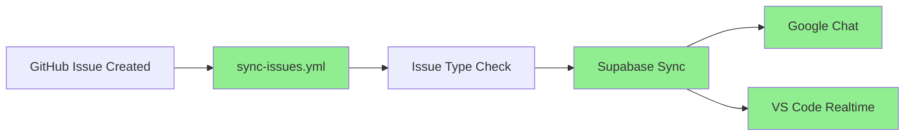
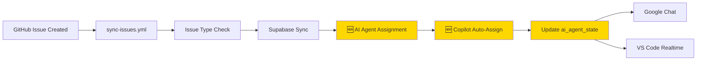

# 🌳 ワークフロー構造 - プロジェクト横断整理

**作成日:** 2026-03-02  
**目的:** 複数プロジェクトに散らばるGitHub Actionsワークフローを一元管理

---

## 📁 プロジェクトツリー構造

```
C:\xampp\htdocs\
├── 🤖 AI Automation Platform (メインプロジェクト)
│   ├── ai-automation-dashboard/          # kenichimiyata - 実装ハブ
│   │   └── .github/workflows/
│   │       ├── sync-issues.yml           # Issue → Supabase 同期 ⭐
│   │       ├── test.yml                  # pytest 自動テスト
│   │       └── bpmn-flow-demo.yml        # BPMN デモ
│   │
│   ├── ai-automation-docs/               # kenichimiyata - ドキュメント
│   │   └── .github/workflows/
│   │       └── (なし - GitHub Pages は自動ビルド)
│   │
│   └── ai-automation-platform/           # bpmbox - 組織リポジトリ
│       └── .github/workflows/
│           └── (なし - Wiki/Project 管理用)
│
├── 🔧 PHPRunner 11 開発環境
│   └── PhPRunner_11/                     # urlounge-ds
│       └── .github/workflows/
│           ├── auto-assign-copilot.yml   # Copilot 自動割り当て ⭐
│           ├── cloud-agent.yml           # Cloud Agent タスク実行 ⭐
│           ├── notify-issue-to-googlechat.yml
│           ├── notify-issue-card-to-googlechat.yml
│           ├── deploy-n8n-workflows.yml
│           └── create-issue-via-dispatch.yml
│
├── 🛍️ ECサイトプロジェクト群
│   ├── shop11/                           # urlounge-ds
│   │   └── .github/workflows/
│   │       ├── test.yml
│   │       ├── notify-parent-on-push.yml
│   │       ├── monitor-pages.yml
│   │       ├── capture-screenshot.yml
│   │       └── capture-on-error.yml
│   │
│   ├── shop5/                            # urlounge-ds
│   └── shop11 copy/
│
└── 🏗️ ローカル開発環境
    └── localProject/
        ├── AUTOCREATER/                  # kenichimiyata
        │   └── .github/workflows/
        │       ├── ai-automation.yml
        │       ├── ai-human-collaboration-ci.yml
        │       ├── deploy-to-huggingface.yml
        │       ├── multi-platform-deploy.yml
        │       ├── shop5-php-tests.yml
        │       └── (他多数)
        │
        └── AUTOCREATE/                   # アーカイブ
            └── .github/workflows/
                └── (レガシーワークフロー)
```

---

## 🎯 ワークフロー カテゴリ分類

### 1. **AI Automation 連携ワークフロー** ⭐ 優先度: 高

#### 1.1 Issue 管理 & Copilot 連携

**【メイン】sync-issues.yml** - `ai-automation-dashboard`
- **機能:** GitHub Issue → Supabase → VS Code Copilot 自動連携
- **トリガー:** `issues: [opened, closed, edited, deleted]`
- **ジョブ構成:**
  1. Issue 種別判定（Milestone/Bug/通常）
  2. Milestone/Bug/通常処理
  3. Supabase 同期
  4. Google Chat 通知
  5. VS Code Realtime 通知

**【参考】auto-assign-copilot.yml** - `PhPRunner_11`
- **機能:** Issue 作成時に Copilot を自動アサイン
- **トリガー:** `issues: [opened]`
- **技術:**
  - GitHub CLI (`gh issue edit`)
  - GraphQL API (`addAssigneesToAssignable`)
  - Node ID を使った Bot 割り当て

**統合方針:**
- `sync-issues.yml` に `auto-assign-copilot.yml` のロジックを統合
- AI Agent 割り当てジョブとして実装

#### 1.2 Cloud Agent タスク実行

**cloud-agent.yml** - `PhPRunner_11`
- **機能:** Issue コメントでタスク実行（`/execute`, `/run` コマンド）
- **トリガー:** `issue_comment: [created]`
- **実行例:**
  - `/execute list-events` - ファイル一覧取得
  - `/run fix-bug` - 自動修正実行
- **統合可能性:** Issue からの直接コマンド実行に活用

---

### 2. **通知ワークフロー** 📢

| ワークフロー | プロジェクト | 機能 | トリガー |
|------------|------------|------|---------|
| `notify-issue-to-googlechat.yml` | PhPRunner_11 | Issue → Google Chat 通知 | `issues: [opened, edited]` |
| `notify-issue-card-to-googlechat.yml` | PhPRunner_11 | カード形式で通知（リッチ） | `issues: [opened]` |
| `notify-parent-on-push.yml` | shop11 | Push 時に親リポジトリへ通知 | `push` |

**統合状況:**
- ✅ `sync-issues.yml` に Google Chat 通知統合済み
- ✅ VS Code Realtime 通知も実装済み

---

### 3. **テスト & CI/CD ワークフロー** 🧪

#### 3.1 pytest 自動テスト

**test.yml** - `ai-automation-dashboard`
- **機能:** Supabase CRUD, GitHub API, E2E 統合テスト
- **ステータス:** ✅ 現役（17テスト実行中）

**shop5-php-tests.yml** - `localProject/AUTOCREATER`
- **機能:** PHPUnit テスト
- **対象:** shop5 ECサイト

#### 3.2 デプロイワークフロー

| ワークフロー | プロジェクト | デプロイ先 |
|------------|------------|-----------|
| `deploy-to-huggingface.yml` | AUTOCREATER | Hugging Face Spaces |
| `multi-platform-deploy.yml` | AUTOCREATER | マルチプラットフォーム |
| `deploy-n8n-workflows.yml` | PhPRunner_11 | n8n ワークフロー |

---

### 4. **モニタリング & スクリーンショット** 📸

**shop11 系:**
- `monitor-pages.yml` - ページ監視
- `capture-screenshot.yml` - 自動スクリーンショット
- `capture-on-error.yml` - エラー時キャプチャ

**用途:** 本番環境の視覚的監視

---

### 5. **レガシー & アーカイブ** 📦

**AUTOCREATE (レガシー):**
- `ai-human-collaboration-ci.yml`
- `deploy-to-hf.yml`
- `pages.yml`

**状態:** アーカイブ済み（AUTOCREATER に統合）

---

## 🔄 統合計画 - Milestone 3

### 現在の実装状況



### 追加する機能（PhPRunner_11 から統合）



---

## 📝 統合タスク一覧

### タスク1: auto-assign-copilot.yml を統合

**統合先:** `ai-automation-dashboard/.github/workflows/sync-issues.yml`

**追加ジョブ:**
```yaml
  assign-to-copilot:
    name: "🤖 Copilot 自動割り当て"
    needs: [sync-to-supabase]
    runs-on: ubuntu-latest
    steps:
      - name: Copilot を Issue にアサイン
        run: |
          # PhPRunner_11/auto-assign-copilot.yml のロジックを移植
          gh issue edit ${{ github.event.issue.number }} --add-assignee Copilot
```

**メリット:**
- Issue 作成 → Supabase 同期 → Copilot 割り当ての完全自動化
- Copilot が割り当てられた Issue を優先処理

### タスク2: cloud-agent.yml の活用検討

**用途:**
- Issue コメントから直接タスク実行
- VS Code Copilot からの `/execute` コマンド対応

**統合方針:**
- 別ワークフローとして残す（異なるトリガー）
- `issue_comment` イベント専用

### タスク3: ドキュメント更新

- [ ] このファイル (`workflow-architecture.md`) を GitHub Pages に公開
- [ ] `PROJECT_STRUCTURE.md` にワークフロー構造を追記
- [ ] `ai-automation-docs/docs/index.md` にリンク追加

---

## 🎯 最終ゴール

### 完全自動化フロー

```
1. GitHub Issue 作成
   ↓
2. sync-issues.yml 実行
   ├─ Issue 種別判定
   ├─ Supabase 同期
   ├─ AI Agent 割り当て (🆕)
   ├─ Copilot 自動アサイン (🆕)
   ├─ ai_agent_state 更新 (🆕)
   ├─ Google Chat 通知
   └─ VS Code Realtime 通知
   ↓
3. VS Code Copilot が自動受信
   ├─ Issue 内容を解析
   ├─ 自動コード生成
   └─ Pull Request 作成
   ↓
4. レビュー & マージ
   ↓
5. ai_agent_state を idle に戻す
```

---

## 📚 参考リンク

- **Issue 自動割り当て PDCA:** [issue-auto-assignment-workflow.md](issue-auto-assignment-workflow.md)
- **Milestone 3 実装計画:** [milestone-3.md](milestone-3.md)
- **システムアーキテクチャ:** [architecture-diagram.md](architecture-diagram.md)
- **Supabase Schema:** [../supabase/schema.sql](../supabase/schema.sql)

---

## 🔧 メンテナンス

### ワークフロー命名規則

| 接頭辞 | 用途 | 例 |
|-------|------|-----|
| `sync-` | データ同期 | `sync-issues.yml` |
| `notify-` | 通知 | `notify-issue-to-googlechat.yml` |
| `deploy-` | デプロイ | `deploy-n8n-workflows.yml` |
| `test-` | テスト | `test.yml` |
| `auto-` | 自動化 | `auto-assign-copilot.yml` |

### 更新履歴

- **2026-03-02:** 初版作成 - プロジェクト横断ワークフロー整理
- **2026-03-02:** PhPRunner_11 の auto-assign-copilot.yml を発見

---

[Back to Documentation](.)
