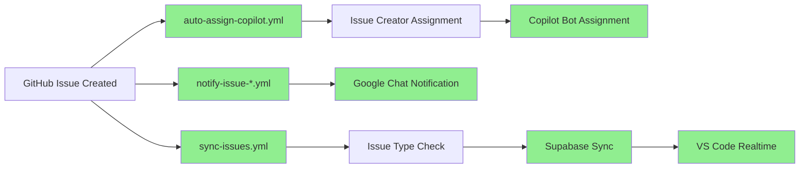

# 🌳 ワークフロー構造 - プロジェクト横断整理

**作成日:** 2026-03-02  
**目的:** 複数プロジェクトに散らばるGitHub Actionsワークフローを一元管理

---

## 📁 プロジェクトツリー構造

```
C:\xampp\htdocs\
├── 🤖 AI Automation Platform (メインプロジェクト)
│   ├── ai-automation-dashboard/          # kenichimiyata - 実装ハブ
│   │   └── .github/workflows/
│   │       ├── sync-issues.yml                      # Issue → Supabase 同期 ⭐
│   │       ├── auto-assign-copilot.yml              # Copilot 自動割り当て ✅ (2026-03-02)
│   │       ├── notify-issue-to-googlechat.yml       # Google Chat 通知 ✅ (2026-03-02)
│   │       ├── notify-issue-card-to-googlechat.yml  # Google Chat カード通知 ✅ (2026-03-02)
│   │       ├── workflow-status-check.yml            # ワークフロー状態確認 🔍 NEW (2026-03-02)
│   │       ├── test.yml                             # pytest 自動テスト
│   │       └── bpmn-flow-demo.yml                   # BPMN デモ
│   │
│   ├── ai-automation-docs/               # kenichimiyata - ドキュメント
│   │   └── .github/workflows/
│   │       └── (なし - GitHub Pages は自動ビルド)
│   │
│   └── ai-automation-platform/           # bpmbox - 組織リポジトリ
│       └── .github/workflows/
│           └── (なし - Wiki/Project 管理用)
│
├── 🔧 PHPRunner 11 開発環境
│   └── PhPRunner_11/                     # urlounge-ds
│       └── .github/workflows/
│           ├── auto-assign-copilot.yml   # Copilot 自動割り当て ⭐
│           ├── cloud-agent.yml           # Cloud Agent タスク実行 ⭐
│           ├── notify-issue-to-googlechat.yml  # Issue → Google Chat 通知 ✅
│           ├── notify-pr-to-googlechat.yml     # PR → Google Chat 通知 🔀 NEW (2026-03-02)
│           ├── notify-issue-card-to-googlechat.yml
│           ├── deploy-n8n-workflows.yml
│           └── create-issue-via-dispatch.yml
│
├── 🛍️ ECサイトプロジェクト群
│   ├── shop11/                           # urlounge-ds
│   │   └── .github/workflows/
│   │       ├── test.yml
│   │       ├── notify-parent-on-push.yml
│   │       ├── notify-pr-to-googlechat.yml      # PR → Google Chat 通知 🔀 NEW (2026-03-02)
│   │       ├── monitor-pages.yml
│   │       ├── capture-screenshot.yml
│   │       └── capture-on-error.yml
│   │
│   ├── shop5/                            # urlounge-ds
│   └── shop11 copy/
│
└── 🏗️ ローカル開発環境
    └── localProject/
        ├── AUTOCREATER/                  # kenichimiyata
        │   └── .github/workflows/
        │       ├── ai-automation.yml
        │       ├── ai-human-collaboration-ci.yml
        │       ├── deploy-to-huggingface.yml
        │       ├── multi-platform-deploy.yml
        │       ├── shop5-php-tests.yml
        │       └── (他多数)
        │
        └── AUTOCREATE/                   # アーカイブ
            └── .github/workflows/
                └── (レガシーワークフロー)
```

---

## 🎯 ワークフロー カテゴリ分類

### 1. **AI Automation 連携ワークフロー** ⭐ 優先度: 高

#### 1.1 Issue 管理 & Copilot 連携

**【メイン】sync-issues.yml** - `ai-automation-dashboard`
- **機能:** GitHub Issue → Supabase → VS Code Copilot 自動連携
- **トリガー:** `issues: [opened, closed, edited, deleted]`
- **ジョブ構成:**
  1. Issue 種別判定（Milestone/Bug/通常）
  2. Milestone/Bug/通常処理
  3. Supabase 同期
  4. Google Chat 通知
  5. VS Code Realtime 通知

**【参考】auto-assign-copilot.yml** - `PhPRunner_11`
- **機能:** Issue 作成時に Copilot を自動アサイン
- **トリガー:** `issues: [opened]`
- **技術:**
  - GitHub CLI (`gh issue edit`)
  - GraphQL API (`addAssigneesToAssignable`)
  - Node ID を使った Bot 割り当て

**統合方針:**
- `sync-issues.yml` に `auto-assign-copilot.yml` のロジックを統合
- AI Agent 割り当てジョブとして実装

#### 1.2 Cloud Agent タスク実行

**cloud-agent.yml** - `PhPRunner_11`
- **機能:** Issue コメントでタスク実行（`/execute`, `/run` コマンド）
- **トリガー:** `issue_comment: [created]`
- **実行例:**
  - `/execute list-events` - ファイル一覧取得
  - `/run fix-bug` - 自動修正実行
- **統合可能性:** Issue からの直接コマンド実行に活用

---

### 2. **通知ワークフロー** 📢

| ワークフロー | プロジェクト | 機能 | トリガー |
|------------|------------|------|---------|
| `notify-issue-to-googlechat.yml` | ai-automation-dashboard, PhPRunner_11 | Issue → Google Chat 通知 | `issues: [opened, edited]` |
| `notify-pr-to-googlechat.yml` 🔀 | PhPRunner_11, shop11 | PR → Google Chat 通知 | `pull_request: [opened]` |
| `notify-issue-card-to-googlechat.yml` | ai-automation-dashboard | カード形式で通知（リッチ） | `issues: [opened]` |
| `workflow-status-check.yml` ✨ | ai-automation-dashboard | ワークフロー実行状態確認 | `issues`, `workflow_run` |
| `notify-parent-on-push.yml` | shop11 | Push 時に親リポジトリへ通知 | `push` |

#### 🔍 workflow-status-check.yml（NEW 2026-03-02）

**目的:** 全ワークフローの実行状態を可視化・通知

**機能:**
- Issue 作成/編集時にトリガー
- 他のワークフロー完了時にもトリガー（`workflow_run`）
- GitHub Actions 実行履歴を取得
- Google Chat にワークフロー状態をまとめて通知
- Actions サマリーに実行状態を出力

**通知内容:**
```
🔍 ワークフロー実行確認

📌 トリガー: issues
🎯 Issue: #43
📋 タイトル: FINAL TEST
⏰ 実行時刻: 2026-03-02 10:30:00

🔸 実行中のワークフロー:
  - 🤖 Auto-Assign Copilot
  - 📢 Google Chat 通知 (テキスト)
  - 📢 Google Chat 通知 (カード)
  - 🔄 Supabase 同期

✅ このワークフローで実行状態を確認できます
🔗 Actions: https://github.com/...
```

**統合状況:**
- ✅ PhPRunner_11 から通知ワークフロー3つ移行完了
- ✅ 新規に状態確認ワークフロー追加
- ✅ VS Code Realtime 通知は sync-issues.yml に統合済み

---

### 3. **テスト & CI/CD ワークフロー** 🧪

#### 3.1 pytest 自動テスト

**test.yml** - `ai-automation-dashboard`
- **機能:** Supabase CRUD, GitHub API, E2E 統合テスト
- **ステータス:** ✅ 現役（17テスト実行中）

**shop5-php-tests.yml** - `localProject/AUTOCREATER`
- **機能:** PHPUnit テスト
- **対象:** shop5 ECサイト

#### 3.2 デプロイワークフロー

| ワークフロー | プロジェクト | デプロイ先 |
|------------|------------|-----------|
| `deploy-to-huggingface.yml` | AUTOCREATER | Hugging Face Spaces |
| `multi-platform-deploy.yml` | AUTOCREATER | マルチプラットフォーム |
| `deploy-n8n-workflows.yml` | PhPRunner_11 | n8n ワークフロー |

---

### 4. **モニタリング & スクリーンショット** 📸

**shop11 系:**
- `monitor-pages.yml` - ページ監視
- `capture-screenshot.yml` - 自動スクリーンショット
- `capture-on-error.yml` - エラー時キャプチャ

**用途:** 本番環境の視覚的監視

---

### 5. **レガシー & アーカイブ** 📦

**AUTOCREATE (レガシー):**
- `ai-human-collaboration-ci.yml`
- `deploy-to-hf.yml`
- `pages.yml`

**状態:** アーカイブ済み（AUTOCREATER に統合）

---

## 🔄 統合計画 - Milestone 3

### ✅ 統合完了済み（2026-03-02）

**PhPRunner_11 から ai-automation-dashboard へワークフロー移行完了:**

1. ✅ `auto-assign-copilot.yml` - Copilot 自動割り当て
2. ✅ `notify-issue-to-googlechat.yml` - Google Chat 通知（テキスト）
3. ✅ `notify-issue-card-to-googlechat.yml` - Google Chat 通知（カード形式）

**動作確認:**
- Issue #43 で kenichimiyata + copilot-swe-agent 自動アサイン成功
- Google Chat への通知配信成功
- GH_TOKEN, GOOGLE_CHAT_WEBHOOK 設定済み

### 現在の実装状況（統合後）



---

## 📝 統合タスク一覧

### ✅ タスク1: auto-assign-copilot.yml を移行（完了 2026-03-02）

**移行先:** `ai-automation-dashboard/.github/workflows/auto-assign-copilot.yml`

**実装内容:**
- Issue 作成時に Issue 作成者と copilot-swe-agent を自動アサイン
- GH_TOKEN を使用（GH_PAT_ASSIGN_BOT から変更）
- GraphQL API で Bot の Node ID を取得してアサイン

**動作確認:**
- Issue #43 で正常動作確認済み
- assignees: kenichimiyata, copilot-swe-agent

### ✅ タスク1.2: Google Chat 通知を移行（完了 2026-03-02）

**移行先:**
- `notify-issue-to-googlechat.yml` - テキスト通知
- `notify-issue-card-to-googlechat.yml` - リッチカード通知

**実装内容:**
- Issue 作成・編集時に Google Chat Space へ通知
- GOOGLE_CHAT_WEBHOOK secret 設定済み
- Python requests でシンプル実装

**動作確認:**
- Issue #41, #42, #43 で通知配信成功

### ⏳ タスク2: VS Code 通知を統合（次のステップ）

**統合先:** `auto-assign-copilot.yml`, `notify-issue-*.yml`

**追加予定:**
```yaml
- name: VS Code Realtime 通知
  run: |
    python scripts/notify_vscode.py \
      "${{ github.event.issue.number }}" \
      "${{ github.event.issue.title }}" \
      "opened"
```

**要件:**
- Supabase chat_history テーブルへ INSERT
- VS Code Copilot がリアルタイム受信
- Issue 番号、タイトル、アクションを通知

### ⏳ タスク3: cloud-agent.yml の移行検討

**用途:**
- Issue コメントから直接タスク実行
- VS Code Copilot からの `/execute` コマンド対応

**統合方針:**
- 別ワークフローとして残す（異なるトリガー: `issue_comment`）
- 段階的に機能追加

---

## 📅 更新履歴

| 日付 | 更新内容 |
|------|---------|
| 2026-03-02 | ✅ PHPRunner_11 から3ワークフロー移行完了 |
| 2026-02-27 | sync-issues.yml 実装完了 |
| 2026-02-26 | ドキュメント初版作成 |

---

## 🎯 次のステップ

### 完全自動化フロー（Milestone 3）

```
1. GitHub Issue 作成
   ↓
2. ⚡ 並列実行（3つのワークフロー）
   ├─ auto-assign-copilot.yml
   │  ├─ Issue 作成者アサイン
   │  └─ copilot-swe-agent アサイン ✅
   │
   ├─ notify-issue-*.yml
   │  └─ Google Chat 通知 ✅
   │
   └─ sync-issues.yml
      ├─ Issue 種別判定
      ├─ Supabase 同期
      └─ VS Code Realtime 通知
   ↓
3. 🔜 次フェーズ: VS Code Copilot が自動受信
   ├─ Issue 内容を解析
   ├─ 自動コード生成
   └─ Pull Request 作成
   ↓
4. レビュー & マージ
   ↓
5. ai_agent_state を idle に戻す
```

**現在の進捗:**
- ✅ Phase 1: Issue → Copilot 自動アサイン
- ✅ Phase 2: Google Chat 通知
- ⏳ Phase 3: VS Code リアルタイム通知統合
- ⏳ Phase 4: Copilot 自動応答・PR 作成

---

## 📚 参考リンク

- **Issue 自動割り当て PDCA:** [issue-auto-assignment-workflow.md](issue-auto-assignment-workflow.md)
- **Milestone 3 実装計画:** [milestone-3.md](milestone-3.md)
- **システムアーキテクチャ:** [architecture-diagram.md](architecture-diagram.md)
- **Supabase Schema:** [../supabase/schema.sql](../supabase/schema.sql)

---

## 🔧 メンテナンス

### ワークフロー命名規則

| 接頭辞 | 用途 | 例 |
|-------|------|-----|
| `sync-` | データ同期 | `sync-issues.yml` |
| `notify-` | 通知 | `notify-issue-to-googlechat.yml` |
| `deploy-` | デプロイ | `deploy-n8n-workflows.yml` |
| `test-` | テスト | `test.yml` |
| `auto-` | 自動化 | `auto-assign-copilot.yml` |

### 更新履歴

- **2026-03-02:** 初版作成 - プロジェクト横断ワークフロー整理
- **2026-03-02:** PhPRunner_11 の auto-assign-copilot.yml を発見

---

[Back to Documentation](.)
